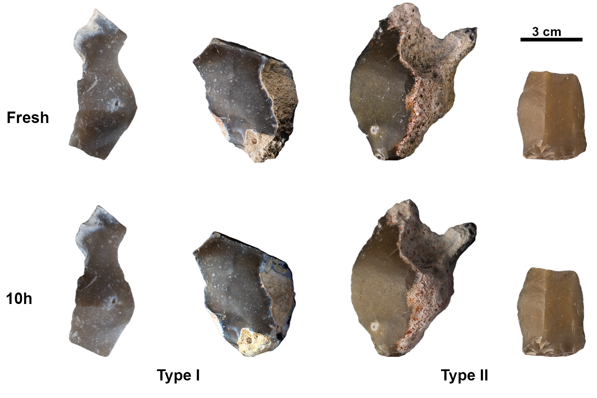
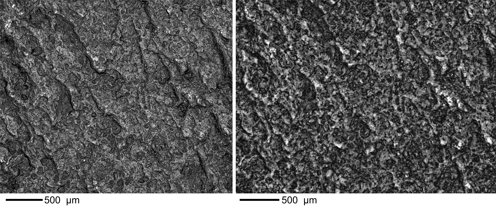
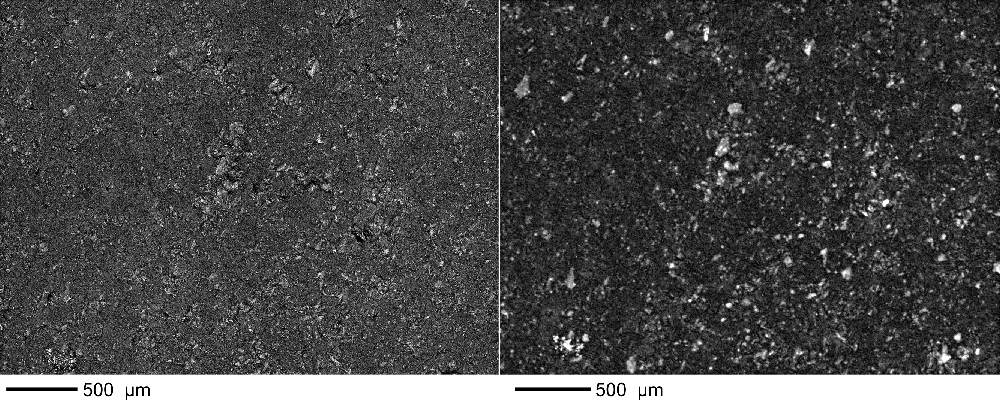
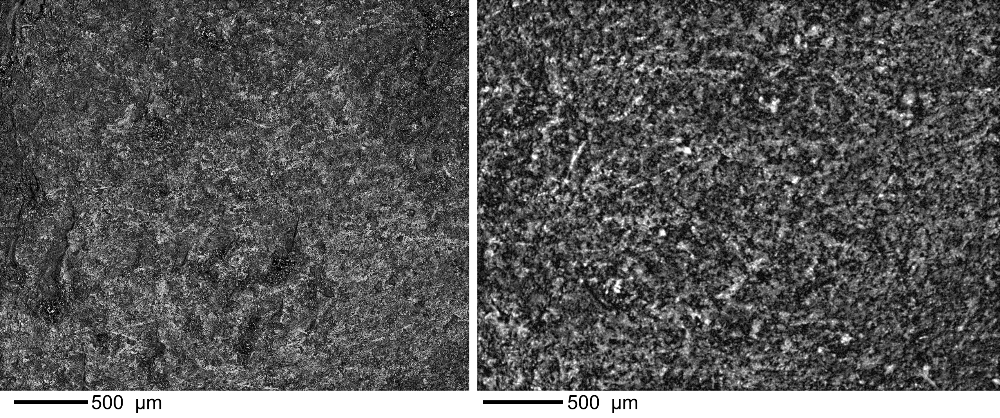

```{r setup, include=FALSE}
knitr::opts_chunk$set(echo = TRUE)
```


Guillermo Bustos-Pérez $^{1,2,3}$, Andreu Olle $^{2,3}$    


<div align="justify">   

## Abstract   

The surface of lithic stone tools from Paleolithic archaeological sites can undergo a range of different postdepositional alterations, including sedimentary erosion induced by water displacement or wind. The surface of flint artifacts can reflect these alterations as changes in texture. Microscopic analyses and grayscale images can be employed to obtain quantitative data to help determine the degree to which the surfaces of flint stone tools have been altered. However, surface quantitative values depend directly on the image capturing system of each microscope. This raises the question of whether the quantitative values are actually capturing the evolution of the surface, whether they are dependent on the type of microscope and its image capturing system, and whether the detection of the degree of abrasion might vary depending on the type of microscope. The present work sought to determine whether data extracted from images from two different microscopes point to the same trends in surface change due to postdepositional alterations. Surface photographs of a sample of 25 flakes were taken using a Dino-Lite Edge 3.0 AM73915MZT and a 3D Optical Profiler Sensofar S neox 090. These flakes represented three different stages of alteration (fresh, ten hours of experimentally-induced sedimentary erosion, and geological neocortex). Results from grayscale images indicate that, despite yielding different numeric ranges, the quantitative values of the images from both types of microscope reflect the same trends in surface change. The classification accuracy of the three stages of erosion did not vary between microscopes.   

**Key words**: microscopic analysis; lithic analysis; lithic taphonomy; postdepositional surface modifications    

## 1) Introduction     

Flint stone tools are among the most common remains recovered from Paleolithic sites. They provide information not only about chrono-cultural developments, but also about the behavioral and spatial organization of Paleolithic groups. However, stone tools from Paleolithic sites may be subjected to any number of postdepositional alterations, most commonly water flow or wind abrasion [byers_flake_2015; @hosfield_flake_2016; @michel_freezing_2019; @petraglia_water_1994; @schick_stone_1986]. These postdepositional processes can disrupt archaeological remains, resulting in horizontal and vertical mixing of artifacts and, consequently, unreliable chrono-cultural interpretations. Therefore, a solid analysis of the integrity of a lithic assemblage is needed prior to its interpretation.   

Postdepositional alterations and their intensity are recorded on the surface of stone tools, most commonly observed in the form of increased ridge width and surface abrasion [@burroni_surface_2002; @bustos-perez_experimental_2019; @bustos-perez_quantification_2024; @chambers_like_2016; @shackley_stream_1974]. Unaided visual assessments of sedimentary abrasion (rounding) can result in an error ratio of over 80%, emphasizing the need for microscopic analyses with quantitative variables [@chambers_like_2016].   

The quantitative characterization of surfaces is an important part of many lithic microscopic analytical approaches. In recent traceological studies, surface texture quantification is often used to identify worked materials [@evans_laser_2008; @ibanez_identifying_2019; @ibanez_quantitative_2021; @macdonald_application_2014; @sferrazza_grey_2023; @stemp_discrimination_2011; @stevens_practical_2010] or test different models of polish development [@ibanez_quantitative_2021]. Another area of lithic microscopic analysis in which surface quantification plays a key role is in the identification, characterization and estimation of the intensity of postdepositional alterations on lithic artifacts [@burroni_surface_2002; @bustos-perez_experimental_2019; @caux_aspects_2018; @chambers_like_2016; @chu_micro-abrasion_2015; @hiscock_need_1985; @hosfield_interpreting_2000; @levi_sala_use_1986]. The development of these analyses has been incorporated in studies focusing on the integrity of the lithic artifacts in archaeological assemblages [@fraile-marquez_facing_2022; @galland_quantifying_2019; @staurset_post-depositional_2023].   

Recent approaches using sequential experimentation, grayscale images [@bustos-perez_quantification_2024; @sferrazza_grey_2023] and texture metrics [@haralick_textural_1973] have demonstrated the viability of quantifying surface changes caused by sedimentary abrasion on flint tools. However, the information contained in the pixels of a photograph may vary according to the capturing system of each microscope. This raises the issue of the importance of microscope agnosticism (meaning that metric values or trends do not vary in relation to the choice of microscope). In the present study, we explored four aspects to explore the issue of microscope agnosticism in relation to sedimentary abrasion.    

  1) Observed trends in quantitative metrics should be consistent independent of the choice of microscope. The combination of sequential experimentation and quantitative metrics [@bustos-perez_quantification_2024; @ibanez_quantitative_2021; @olle_use_2014] has resulted in a certain degree of confidence regarding how the surface of flint changes progressively as result of a mechanical action. However, the current understanding of this change is directly related to the image acquisition procedure and the quantitative variables derived from those images. Ideally, quantitative trends would remain consistent regardless of the type of microscope used.    
  
  2) Collinearity or multicollinearity of metric features extracted from images should be considered. Several approaches [@bustos-perez_quantification_2024; @ibanez_quantitative_2021; @pedergnana_polish_2020; @sferrazza_grey_2023; @stevens_practical_2010] use machine learning (ML) classification algorithms on metric features extracted from images. Along with higher accuracy, one substantial advantage of ML algorithms is that they can provide insights into feature importance for classification. Collinearity is generally not considered problematic for classification metrics, provided that any collinearity present in the training set is also present in the predicted sample. However, collinearity is considered to have substantial effects on interpreting feature importance due to unstable coefficients or redundancy in feature selection. Thus, it is important to be aware of the presence of collinear or multicollinear variables when using quantitative features extracted from images. Images of the same area from different microscopes will vary depending on the image acquiring system, and as a consequence, the presence of collinearity among the extracted features is also expected to vary from microscope to microscope. A microscope generating images with fewer pairs of collinear variables can be considered more reliable for the quantitative characterization of a surface.   
  
  3) Classification accuracy should remain similar despite the use of variables obtained from the images of different microscopes. Accuracy can be affected when multicollinearity is present among the variables. A common approach to this problem is the use of dimensionality reduction methods (PCA, t-SNE; @naes_understanding_2001), which make it possible to combine multiple collinear variables while avoiding the loss of information. If multicollinearity is present, the accuracy of a model using raw variables should be compared with a model using dimensionally reduced variables.    
  
  4) Consistency of variable importance among classification algorithms and photographs obtained from different microscopes is a good indicator of microscope agnosticism. However, as previously indicated, variable importance can be affected by collinearity among predictors. This is an important consideration since the importance of a pair of variables might be a result of their collinearity. Additionally, it makes it possible to consider which groups of metric variables should be emphasized when analyzing surface change due to a given mechanical action.    
  
## 2) Methods   

### 2.1) Experimental sample and cleaning protocol    

The sample consisted of 25 flakes experimentally knapped by one of the authors (GBP) using direct percussion with a hard hammer. The flakes came from three different types of flint (Table 1), all of them south Madrid Miocene flint [@bustillo_caracterizacion_2012; @bustillo_caracteristicas_2005] from different locations. South Madrid Miocene flints were formed by the replacement of sedimentary rocks which had filled the original basin, which is thought to have taken place under continental conditions such as alluvial plain deposits, shallow lacustrine waters, and marshes [@bustillo_caracterizacion_2012]. Macroscopic analysis of the flints shows that they present a fine, opaque, homogeneous surface and blue/grey and reddish/ocher coloration. There is also a relative absence of opal in these flints, although geodes and pseudo-morphs are sometimes present.    

```{r}
library(tidyverse)
load("Data/Data-Both-micro-v3.RData")

Data %>% 
  group_by(Flint.Type, Flake.Time) %>% 
  summarise(n_distinct(Flake.ID))
```

Five type 1 and 2 flakes were analyzed to obtain images of the fresh surface, while four type 1 flakes and five type 2 flakes were submitted to ten hours of rounding in a tumbling machine (KT-3010 SUPER-TUMBLER). The sedimentary matrix employed to simulate rounding consisted of a mix of sand and water (a total weight of 5 kg of which 30–40% was water). Sediment was obtained from the quaternary levels of the Madrid basin and was made up of fine quartz sands with silt and partial carbonation. The tumbler machine was set at continuous direction at 83 rpm. The average weight of the flakes introduced into the tumbler was 26.25 g.    

Geological images of the neocortex were obtained from three type 3 flakes and three type 2 flakes (Table 2). These images of geological neocortex serve as reference samples for extreme levels of sedimentary abrasion.    


 
 Possible contaminants were removed by means of a multi-step procedure based on a previous study [@pedergnana_modern_2016. The present study used a two-step procedure consisting of an ultrasonic bath (frequency of 40 kHz) in a 2% neutral soap (Derquim) solution for 10 to 15 minutes, followed by a second sonic bath in pure acetone for another 10 to 15 minutes. After each step, the lithic artifacts were placed in a tap water bath and finally dried using compressed air. During the cleaning protocol and microscopic analysis, all artifacts were handled using powder-free surgical gloves. 

```{r}
Data %>% group_by(Microscope, Flake.Time) %>% 
  summarise(Phot.Per.Time = n())
```

### 2.2) Image acquisition and processing     

In order to compare images, the field of view (FOV) and pixel ratio of both microscopes must be as similar as possible. Parameters of the Dino-Lite Edge 3.0 AM73915MZT were kept the same as in previous experiments [@bustos-perez_quantification_2024], with a FOV of 3.28 x 2.46 mm and a pixel ratio of 2548 x 1918. As a result, each pixel measured 1.28 μm (width) by 1.28 μm (height). The Dino-Lite Edge 3.0 AM73915MZT microscope was mounted in a Dino-Lite RK-06-AE stand in order to ensure verticality, and a N3C-D2 diffuser cap was used to ensure the even distribution of light. In the process of taking each photograph, the region of interest on the flint was manually positioned as horizontally as possible [@calandra_surface_2022]. To avoid problems due to focus variation, each surface was photographed several times at different heights, and the sequences obtained were mounted using a Helicon Focus 7.7.2. Normally, satisfactory stacking required between two and four images, although additional images were employed when needed.    



The Sensofar S neox 090 zoom was manually adjusted to the most similar FOV (3.18 x 2.65 mm) with 2x2 mosaics taken for each image. All images were obtained using a x10 objective lens (numerical aperture 0.30) in light scanning confocal mode (microdisplay scanning confocal microscopy) at 5 Mp resolution with at least 95% of the information retrieved. The original Sensofar S neox 090 photographs had a pixel ratio of 4616 x 3848. This resulted in each pixel measuring 0.69 x 0.69 μm. In order to match the FOV and pixel ratio of the Sensofar S neox 090 zoom to those of MP previous studies [@bustos-perez_quantification_2024], the images were cropped and the pixels downsampled. Although the images from the Dino-Lite Edge 3.0 AM73915MZT microscope were slightly wider (0.10 mm), this resulted in almost identical FOV, pixel ratios and pixel widths/heights (Table 3).    

Both sets of images underwent the same two-step image treatment procedure employed in a previous study [@bustos-perez_quantification_2024]. First, the Fiji [@schindelin_imagej_2015] “subtract background” plugin was used to minimize the effects of different lighting and differing flint coloration. Second, the “enhance contrast” function was used to desaturate the images by normalizing their histograms. This process provided a gray-level image for use as input for the statistical analysis. All analyzed images were in TIFF format.     




Photographs of fresh and neocortex surfaces were obtained in the same areas with both microscopes. The surface of the flakes that had undergone 10h of rounding was initially recognized with both types of microscopes and the most-developed surfaces were photographed. This is a common procedure when analyzing microscopic traces, as the most-developed area [@ibanez_quantitative_2021; @pedergnana_polish_2020] is targeted for photography. This ensured the maximum visibility of the abrasion for each microscope.    

```{r}
data.frame(
  `Microscope images` = c("AM73915MZT", "S neox 090 (original images)", "S neox 090(transformed)"),
  `Image aspect ratio` = c(1.33, 1.19, 1.33),
  `FOV (mm)` = c("3.28 x 2.46", "3.18 x 2.65", "3.18 x 2.46"),
  `Pixel Ratio` = c("2548 x 1918", "4616 x 3848", "2480 x 1918"),
  `Pixel width height (μm)` = c("1.28 x 1.28", "0.69 x 0.69", "1.28 x 1.28"))
```


### 2.3) Quantitative analysis        

Three groups of metrics were extracted from the microscope images (Table 4). The first group corresponds to descriptive statistics of the gray-level values in each image, which can be divided into measures of central tendency (mean, mode and median), and measures of deviation and distribution (standard deviation, kurtosis and skewness).    

```{r}

```


## References   


</div> 