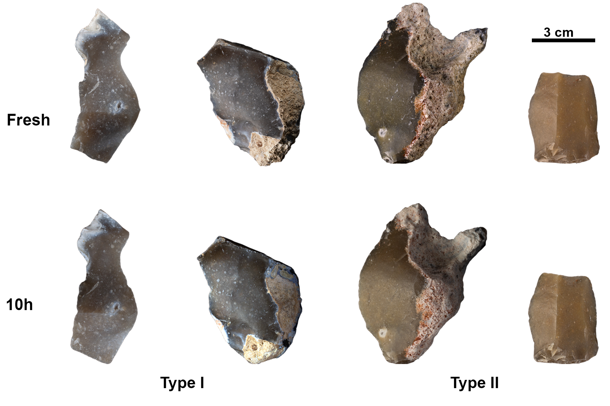

Guillermo Bustos-Pérez $^{1,2,3}$, Andreu Olle $^{2,3}$

<div align="justify">

## Abstract

The surface of lithic stone tools from Paleolithic archaeological sites
can undergo a range of different postdepositional alterations, including
sedimentary erosion induced by water displacement or wind. The surface
of flint artifacts can reflect these alterations as changes in texture.
Microscopic analyses and grayscale images can be employed to obtain
quantitative data to help determine the degree to which the surfaces of
flint stone tools have been altered. However, surface quantitative
values depend directly on the image capturing system of each microscope.
This raises the question of whether the quantitative values are actually
capturing the evolution of the surface, whether they are dependent on
the type of microscope and its image capturing system, and whether the
detection of the degree of abrasion might vary depending on the type of
microscope. The present work sought to determine whether data extracted
from images from two different microscopes point to the same trends in
surface change due to postdepositional alterations. Surface photographs
of a sample of 25 flakes were taken using a Dino-Lite Edge 3.0
AM73915MZT and a 3D Optical Profiler Sensofar S neox 090. These flakes
represented three different stages of alteration (fresh, ten hours of
experimentally-induced sedimentary erosion, and geological neocortex).
Results from grayscale images indicate that, despite yielding different
numeric ranges, the quantitative values of the images from both types of
microscope reflect the same trends in surface change. The classification
accuracy of the three stages of erosion did not vary between
microscopes.

**Key words**: microscopic analysis; lithic analysis; lithic taphonomy;
postdepositional surface modifications

## 1) Introduction

Flint stone tools are among the most common remains recovered from
Paleolithic sites. They provide information not only about
chrono-cultural developments, but also about the behavioral and spatial
organization of Paleolithic groups. However, stone tools from
Paleolithic sites may be subjected to any number of postdepositional
alterations, most commonly water flow or wind abrasion
\[byers_flake_2015; Hosfield and Chambers
([2016](#ref-hosfield_flake_2016)); Michel et al.
([2019](#ref-michel_freezing_2019)); Petraglia and Potts
([1994](#ref-petraglia_water_1994)); Schick
([1986](#ref-schick_stone_1986))\]. These postdepositional processes can
disrupt archaeological remains, resulting in horizontal and vertical
mixing of artifacts and, consequently, unreliable chrono-cultural
interpretations. Therefore, a solid analysis of the integrity of a
lithic assemblage is needed prior to its interpretation.

Postdepositional alterations and their intensity are recorded on the
surface of stone tools, most commonly observed in the form of increased
ridge width and surface abrasion ([Burroni et al.,
2002](#ref-burroni_surface_2002); [Bustos-Pérez et al.,
2019](#ref-bustos-perez_experimental_2019); [Bustos-Pérez and Ollé,
2024](#ref-bustos-perez_quantification_2024); [Chambers,
2016](#ref-chambers_like_2016); [Shackley,
1974](#ref-shackley_stream_1974)). Unaided visual assessments of
sedimentary abrasion (rounding) can result in an error ratio of over
80%, emphasizing the need for microscopic analyses with quantitative
variables ([Chambers, 2016](#ref-chambers_like_2016)).

The quantitative characterization of surfaces is an important part of
many lithic microscopic analytical approaches. In recent traceological
studies, surface texture quantification is often used to identify worked
materials ([Evans and Donahue, 2008](#ref-evans_laser_2008); [Ibáñez et
al., 2019](#ref-ibanez_identifying_2019); [Ibáñez and Mazzucco,
2021](#ref-ibanez_quantitative_2021); [Macdonald,
2014](#ref-macdonald_application_2014); [Sferrazza,
2023](#ref-sferrazza_grey_2023); [Stemp and Chung,
2011](#ref-stemp_discrimination_2011); [Stevens et al.,
2010](#ref-stevens_practical_2010)) or test different models of polish
development ([Ibáñez and Mazzucco,
2021](#ref-ibanez_quantitative_2021)). Another area of lithic
microscopic analysis in which surface quantification plays a key role is
in the identification, characterization and estimation of the intensity
of postdepositional alterations on lithic artifacts ([Burroni et al.,
2002](#ref-burroni_surface_2002); [Bustos-Pérez et al.,
2019](#ref-bustos-perez_experimental_2019); [Caux et al.,
2018](#ref-caux_aspects_2018); [Chambers,
2016](#ref-chambers_like_2016); [Chu et al.,
2015](#ref-chu_micro-abrasion_2015); [Hiscock,
1985](#ref-hiscock_need_1985); [Hosfield et al.,
2000](#ref-hosfield_interpreting_2000); [Levi Sala,
1986](#ref-levi_sala_use_1986)). The development of these analyses has
been incorporated in studies focusing on the integrity of the lithic
artifacts in archaeological assemblages ([Fraile-Márquez et al.,
2022](#ref-fraile-marquez_facing_2022); [Galland et al.,
2019](#ref-galland_quantifying_2019); [Staurset et al.,
2023](#ref-staurset_post-depositional_2023)).

Recent approaches using sequential experimentation, grayscale images
([Bustos-Pérez and Ollé, 2024](#ref-bustos-perez_quantification_2024);
[Sferrazza, 2023](#ref-sferrazza_grey_2023)) and texture metrics
([Haralick et al., 1973](#ref-haralick_textural_1973)) have demonstrated
the viability of quantifying surface changes caused by sedimentary
abrasion on flint tools. However, the information contained in the
pixels of a photograph may vary according to the capturing system of
each microscope. This raises the issue of the importance of microscope
agnosticism (meaning that metric values or trends do not vary in
relation to the choice of microscope). In the present study, we explored
four aspects to explore the issue of microscope agnosticism in relation
to sedimentary abrasion.

1)  Observed trends in quantitative metrics should be consistent
    independent of the choice of microscope. The combination of
    sequential experimentation and quantitative metrics ([Bustos-Pérez
    and Ollé, 2024](#ref-bustos-perez_quantification_2024); [Ibáñez and
    Mazzucco, 2021](#ref-ibanez_quantitative_2021); [Ollé and Vergès,
    2014](#ref-olle_use_2014)) has resulted in a certain degree of
    confidence regarding how the surface of flint changes progressively
    as result of a mechanical action. However, the current understanding
    of this change is directly related to the image acquisition
    procedure and the quantitative variables derived from those images.
    Ideally, quantitative trends would remain consistent regardless of
    the type of microscope used.

2)  Collinearity or multicollinearity of metric features extracted from
    images should be considered. Several approaches ([Bustos-Pérez and
    Ollé, 2024](#ref-bustos-perez_quantification_2024); [Ibáñez and
    Mazzucco, 2021](#ref-ibanez_quantitative_2021); [Pedergnana et al.,
    2020](#ref-pedergnana_polish_2020); [Sferrazza,
    2023](#ref-sferrazza_grey_2023); [Stevens et al.,
    2010](#ref-stevens_practical_2010)) use machine learning (ML)
    classification algorithms on metric features extracted from images.
    Along with higher accuracy, one substantial advantage of ML
    algorithms is that they can provide insights into feature importance
    for classification. Collinearity is generally not considered
    problematic for classification metrics, provided that any
    collinearity present in the training set is also present in the
    predicted sample. However, collinearity is considered to have
    substantial effects on interpreting feature importance due to
    unstable coefficients or redundancy in feature selection. Thus, it
    is important to be aware of the presence of collinear or
    multicollinear variables when using quantitative features extracted
    from images. Images of the same area from different microscopes will
    vary depending on the image acquiring system, and as a consequence,
    the presence of collinearity among the extracted features is also
    expected to vary from microscope to microscope. A microscope
    generating images with fewer pairs of collinear variables can be
    considered more reliable for the quantitative characterization of a
    surface.

3)  Classification accuracy should remain similar despite the use of
    variables obtained from the images of different microscopes.
    Accuracy can be affected when multicollinearity is present among the
    variables. A common approach to this problem is the use of
    dimensionality reduction methods (PCA, t-SNE; Naes and Mevik
    ([2001](#ref-naes_understanding_2001))), which make it possible to
    combine multiple collinear variables while avoiding the loss of
    information. If multicollinearity is present, the accuracy of a
    model using raw variables should be compared with a model using
    dimensionally reduced variables.

4)  Consistency of variable importance among classification algorithms
    and photographs obtained from different microscopes is a good
    indicator of microscope agnosticism. However, as previously
    indicated, variable importance can be affected by collinearity among
    predictors. This is an important consideration since the importance
    of a pair of variables might be a result of their collinearity.
    Additionally, it makes it possible to consider which groups of
    metric variables should be emphasized when analyzing surface change
    due to a given mechanical action.

## 2) Methods

### 2.1) Experimental sample and cleaning protocol

The sample consisted of 25 flakes experimentally knapped by one of the
authors (GBP) using direct percussion with a hard hammer. The flakes
came from three different types of flint (Table 1), all of them south
Madrid Miocene flint ([Bustillo et al.,
2012](#ref-bustillo_caracterizacion_2012); [Bustillo and Pérez-Jiménez,
2005](#ref-bustillo_caracteristicas_2005)) from different locations.
South Madrid Miocene flints were formed by the replacement of
sedimentary rocks which had filled the original basin, which is thought
to have taken place under continental conditions such as alluvial plain
deposits, shallow lacustrine waters, and marshes ([Bustillo et al.,
2012](#ref-bustillo_caracterizacion_2012)). Macroscopic analysis of the
flints shows that they present a fine, opaque, homogeneous surface and
blue/grey and reddish/ocher coloration. There is also a relative absence
of opal in these flints, although geodes and pseudo-morphs are sometimes
present.

``` r
library(tidyverse)
```

    ## ── Attaching core tidyverse packages ──────────────────────── tidyverse 2.0.0 ──
    ## ✔ dplyr     1.1.4     ✔ readr     2.1.5
    ## ✔ forcats   1.0.0     ✔ stringr   1.5.1
    ## ✔ ggplot2   3.5.1     ✔ tibble    3.2.1
    ## ✔ lubridate 1.9.3     ✔ tidyr     1.3.1
    ## ✔ purrr     1.0.2     
    ## ── Conflicts ────────────────────────────────────────── tidyverse_conflicts() ──
    ## ✖ dplyr::filter() masks stats::filter()
    ## ✖ dplyr::lag()    masks stats::lag()
    ## ℹ Use the conflicted package (<http://conflicted.r-lib.org/>) to force all conflicts to become errors

``` r
load("Data/Data-Both-micro-v3.RData")

Data %>% 
  group_by(Flint.Type, Flake.Time) %>% 
  summarise(n_distinct(Flake.ID))
```

    ## `summarise()` has grouped output by 'Flint.Type'. You can override using the
    ## `.groups` argument.

    ## # A tibble: 6 × 3
    ## # Groups:   Flint.Type [3]
    ##   Flint.Type Flake.Time `n_distinct(Flake.ID)`
    ##   <chr>      <fct>                       <int>
    ## 1 GeoSample  Neocortex                       3
    ## 2 Type_1     Fresh                           5
    ## 3 Type_1     Ten.Hours                       4
    ## 4 Type_2     Fresh                           5
    ## 5 Type_2     Ten.Hours                       5
    ## 6 Type_2     Neocortex                       3

Five type 1 and 2 flakes were analyzed to obtain images of the fresh
surface, while four type 1 flakes and five type 2 flakes were submitted
to ten hours of rounding in a tumbling machine (KT-3010 SUPER-TUMBLER).
The sedimentary matrix employed to simulate rounding consisted of a mix
of sand and water (a total weight of 5 kg of which 30–40% was water).
Sediment was obtained from the quaternary levels of the Madrid basin and
was made up of fine quartz sands with silt and partial carbonation. The
tumbler machine was set at continuous direction at 83 rpm. The average
weight of the flakes introduced into the tumbler was 26.25 g.

Geological images of the neocortex were obtained from three type 3
flakes and three type 2 flakes (Table 2). These images of geological
neocortex serve as reference samples for extreme levels of sedimentary
abrasion.

<figure>

<figcaption aria-hidden="true">Sample of experimental materials before
and after 10h of sedimentary abrasion (photographs by M. D.
Guillén).</figcaption>
</figure>

Possible contaminants were removed by means of a multi-step procedure
based on a previous study \[Pedergnana et al.
([2016](#ref-pedergnana_modern_2016)). The present study used a two-step
procedure consisting of an ultrasonic bath (frequency of 40 kHz) in a 2%
neutral soap (Derquim) solution for 10 to 15 minutes, followed by a
second sonic bath in pure acetone for another 10 to 15 minutes. After
each step, the lithic artifacts were placed in a tap water bath and
finally dried using compressed air. During the cleaning protocol and
microscopic analysis, all artifacts were handled using powder-free
surgical gloves.

``` r
Data %>% group_by(Microscope, Flake.Time) %>% 
  summarise(Phot.Per.Time = n())
```

    ## `summarise()` has grouped output by 'Microscope'. You can override using the
    ## `.groups` argument.

    ## # A tibble: 6 × 3
    ## # Groups:   Microscope [2]
    ##   Microscope          Flake.Time Phot.Per.Time
    ##   <chr>               <fct>              <int>
    ## 1 Dinolite.Edge       Fresh                100
    ## 2 Dinolite.Edge       Ten.Hours             87
    ## 3 Dinolite.Edge       Neocortex             71
    ## 4 Sensofar.S.neox.090 Fresh                100
    ## 5 Sensofar.S.neox.090 Ten.Hours            105
    ## 6 Sensofar.S.neox.090 Neocortex             71

### 2.2) Image acquisition and processing

In order to compare images, the field of view (FOV) and pixel ratio of
both microscopes must be as similar as possible. Parameters of the
Dino-Lite Edge 3.0 AM73915MZT were kept the same as in previous
experiments ([Bustos-Pérez and Ollé,
2024](#ref-bustos-perez_quantification_2024)), with a FOV of 3.28 x 2.46
mm and a pixel ratio of 2548 x 1918. As a result, each pixel measured
1.28 μm (width) by 1.28 μm (height). The Dino-Lite Edge 3.0 AM73915MZT
microscope was mounted in a Dino-Lite RK-06-AE stand in order to ensure
verticality, and a N3C-D2 diffuser cap was used to ensure the even
distribution of light. In the process of taking each photograph, the
region of interest on the flint was manually positioned as horizontally
as possible ([Calandra et al., 2022](#ref-calandra_surface_2022)). To
avoid problems due to focus variation, each surface was photographed
several times at different heights, and the sequences obtained were
mounted using a Helicon Focus 7.7.2. Normally, satisfactory stacking
required between two and four images, although additional images were
employed when needed.

<figure>

<figcaption aria-hidden="true">Example of two images from the same
neocortex surface. Left: Sensofar S neox 090; right: Dino-Lite Edge 3.0
AM73915MZT. Both images after processing using Fiji/ImageJ</figcaption>
</figure>

The Sensofar S neox 090 zoom was manually adjusted to the most similar
FOV (3.18 x 2.65 mm) with 2x2 mosaics taken for each image. All images
were obtained using a x10 objective lens (numerical aperture 0.30) in
light scanning confocal mode (microdisplay scanning confocal microscopy)
at 5 Mp resolution with at least 95% of the information retrieved. The
original Sensofar S neox 090 photographs had a pixel ratio of 4616 x
3848. This resulted in each pixel measuring 0.69 x 0.69 μm. In order to
match the FOV and pixel ratio of the Sensofar S neox 090 zoom to those
of MP previous studies ([Bustos-Pérez and Ollé,
2024](#ref-bustos-perez_quantification_2024)), the images were cropped
and the pixels downsampled. Although the images from the Dino-Lite Edge
3.0 AM73915MZT microscope were slightly wider (0.10 mm), this resulted
in almost identical FOV, pixel ratios and pixel widths/heights (Table
3).

Both sets of images underwent the same two-step image treatment
procedure employed in a previous study ([Bustos-Pérez and Ollé,
2024](#ref-bustos-perez_quantification_2024)). First, the Fiji
([Schindelin et al., 2015](#ref-schindelin_imagej_2015)) “subtract
background” plugin was used to minimize the effects of different
lighting and differing flint coloration. Second, the “enhance contrast”
function was used to desaturate the images by normalizing their
histograms. This process provided a gray-level image for use as input
for the statistical analysis. All analyzed images were in TIFF format.

 

  

  

Photographs of fresh and neocortex surfaces were obtained in the same
areas with both microscopes. The surface of the flakes that had
undergone 10h of rounding was initially recognized with both types of
microscopes and the most-developed surfaces were photographed. This is a
common procedure when analyzing microscopic traces, as the
most-developed area ([Ibáñez and Mazzucco,
2021](#ref-ibanez_quantitative_2021); [Pedergnana et al.,
2020](#ref-pedergnana_polish_2020)) is targeted for photography. This
ensured the maximum visibility of the abrasion for each microscope.

``` r
kableExtra::kable(
  data.frame(
  `Microscope images` = c("AM73915MZT", "S neox 090 (original images)", "S neox 090(transformed)"),
  `Image aspect ratio` = c(1.33, 1.19, 1.33),
  `FOV (mm)` = c("3.28 x 2.46", "3.18 x 2.65", "3.18 x 2.46"),
  `Pixel Ratio` = c("2548 x 1918", "4616 x 3848", "2480 x 1918"),
  `Pixel width height (μm)` = c("1.28 x 1.28", "0.69 x 0.69", "1.28 x 1.28"))
) 
```

| Microscope.images            | Image.aspect.ratio | FOV..mm.    | Pixel.Ratio | Pixel.width.height..μm. |
|:-----------------------------|-------------------:|:------------|:------------|:------------------------|
| AM73915MZT                   |               1.33 | 3.28 x 2.46 | 2548 x 1918 | 1.28 x 1.28             |
| S neox 090 (original images) |               1.19 | 3.18 x 2.65 | 4616 x 3848 | 0.69 x 0.69             |
| S neox 090(transformed)      |               1.33 | 3.18 x 2.46 | 2480 x 1918 | 1.28 x 1.28             |

### 2.3) Quantitative analysis

Three groups of metrics were extracted from the microscope images (Table
4). The first group corresponds to descriptive statistics of the
gray-level values in each image, which can be divided into measures of
central tendency (mean, mode and median), and measures of deviation and
distribution (standard deviation, kurtosis and skewness).

``` r
kableExtra::kable(
  data.frame(
  Name = c("Mean", "Mode", "Median", "Standard Deviation", "Skewness", "Kurtosis", "RMS deviation/roughness", "Arithmetical mean deviation", "Skewness assessed profile", "Kurtosis assessed profile", "Angular second moment", "Contrast", "Correlation", "Inverse different moment", "Entropy"),
  Acronym = c("x̄", "Mo", "m", "SD", "Sk", "Ku", "Rq", "Ra", "Rsk", "Rku", "ASM", "CONT", "CORR", "IDM", "ENT"),
  Group = c("C", "C", "C", "D&D", "D&D", "D&D", "R", "R", "R", "R", "T", "T", "T", "T", "T"),
  Description = c("Central tendency of the sample", "Most repeated value", "Value of at least half the sample", "Variation expected from the mean", "Asymmetry of the distribution", "Tailedness of the distribution", "Indicator of surface roughness", "Deviation of a surface from a mean height", "Indicator of the departure from surface symmetry", "Sharpness of the peaks", "Measure of homogeneity in the image", "Indicative of local variations", "How a reference pixel is related to its neighbor", "Closeness of the distribution of the GLCM elements to the GLCM diagonal.", "Amount of irremediable chaos or disorder in an image")
  )
)
```

| Name                        | Acronym | Group | Description                                                              |
|:----------------------------|:--------|:------|:-------------------------------------------------------------------------|
| Mean                        | x̄       | C     | Central tendency of the sample                                           |
| Mode                        | Mo      | C     | Most repeated value                                                      |
| Median                      | m       | C     | Value of at least half the sample                                        |
| Standard Deviation          | SD      | D&D   | Variation expected from the mean                                         |
| Skewness                    | Sk      | D&D   | Asymmetry of the distribution                                            |
| Kurtosis                    | Ku      | D&D   | Tailedness of the distribution                                           |
| RMS deviation/roughness     | Rq      | R     | Indicator of surface roughness                                           |
| Arithmetical mean deviation | Ra      | R     | Deviation of a surface from a mean height                                |
| Skewness assessed profile   | Rsk     | R     | Indicator of the departure from surface symmetry                         |
| Kurtosis assessed profile   | Rku     | R     | Sharpness of the peaks                                                   |
| Angular second moment       | ASM     | T     | Measure of homogeneity in the image                                      |
| Contrast                    | CONT    | T     | Indicative of local variations                                           |
| Correlation                 | CORR    | T     | How a reference pixel is related to its neighbor                         |
| Inverse different moment    | IDM     | T     | Closeness of the distribution of the GLCM elements to the GLCM diagonal. |
| Entropy                     | ENT     | T     | Amount of irremediable chaos or disorder in an image                     |

## References

</div>

<div id="refs" class="references csl-bib-body hanging-indent"
entry-spacing="0">

<div id="ref-burroni_surface_2002" class="csl-entry">

Burroni, D., Donahue, R.E., Pollard, A.M., 2002. The Surface Alteration
Features of Flint Artefacts as a Record of Environmental Processes.
Journal of Archaeological Science 29, 1277–1287.
<https://doi.org/10.1006/jasc.2001.0771>

</div>

<div id="ref-bustillo_caracteristicas_2005" class="csl-entry">

Bustillo, M.A., Pérez-Jiménez, J.L., 2005. Características diferenciales
y génesis de los niveles silíceos explotados en el yacimiento
arqueológico de Casa Montero (Vicálvaro, Madrid). Geogaceta 38, 243–246.

</div>

<div id="ref-bustillo_caracterizacion_2012" class="csl-entry">

Bustillo, M.Á., Pérez-Jiménez, J.L., Bustillo, M., 2012. Caracterización
geoquímica de rocas sedimentarias formadas por silicificación como
fuentes de suministro de utensilios líticos (Mioceno, cuenca de Madrid).
Revista Mexicana de Ciencias Geológicas 29, 233–247.

</div>

<div id="ref-bustos-perez_experimental_2019" class="csl-entry">

Bustos-Pérez, G., Díaz, S., Baena, J., 2019. An Experimental Approach to
Degrees of Rounding Among Lithic Artifacts. Journal of Archaeological
Method and Theory 26, 1243–1275.
<https://doi.org/10.1007/s10816-018-9409-8>

</div>

<div id="ref-bustos-perez_quantification_2024" class="csl-entry">

Bustos-Pérez, G., Ollé, A., 2024. The quantification of surface abrasion
on flint stone tools. Archaeometry 66, 247–265.
<https://doi.org/10.1111/arcm.12913>

</div>

<div id="ref-calandra_surface_2022" class="csl-entry">

Calandra, I., Bob, K., Merceron, G., Blateyron, F., Hildebrandt, A.,
Schulz-Kornas, E., Souron, A., Winkler, D.E., 2022. Surface texture
analysis in Toothfrax and MountainsMap® SSFA module: Different software
packages, different results? Peer Community Journal 2, e77.
<https://doi.org/10.24072/pcjournal.204>

</div>

<div id="ref-caux_aspects_2018" class="csl-entry">

Caux, S., Galland, A., Queffelec, A., Bordes, J.-G., 2018. Aspects and
characterization of chert alteration in an archaeological context: A
qualitative to quantitative pilot study. Journal of Archaeological
Science: Reports 20, 210–219.
<https://doi.org/10.1016/j.jasrep.2018.04.027>

</div>

<div id="ref-chambers_like_2016" class="csl-entry">

Chambers, J.C., 2016. [Like a rolling stone? The identification of
fluvial transportation damage signatures on secondary context
bifaces](http://journal.lithics.org/wp-content/uploads/Lithics_24_2003_Chambers_66_77.pdf).
Lithics 24, 66–77.

</div>

<div id="ref-chu_micro-abrasion_2015" class="csl-entry">

Chu, W., Thompson, C., Hosfield, R., 2015. Micro-abrasion of flint
artifacts by mobile sediments: A taphonomic approach. Archaeological and
Anthropological Sciences 7, 3–11.
<https://doi.org/10.1007/s12520-013-0157-0>

</div>

<div id="ref-evans_laser_2008" class="csl-entry">

Evans, A.A., Donahue, R.E., 2008. Laser scanning confocal microscopy: A
potential technique for the study of lithic microwear. Journal of
Archaeological Science 35, 2223–2230.
<https://doi.org/10.1016/j.jas.2008.02.006>

</div>

<div id="ref-fraile-marquez_facing_2022" class="csl-entry">

Fraile-Márquez, C., Diez-Martín, F., Duque-Martínez, J., Uribelarrea,
D., Sánchez-Yustos, P., Francisco, S. de, Baquedano, E., Mabulla, A.,
Domínguez-Rodrigo, M., 2022. Facing the palimpsest conundrum: An
archaeo-stratigraphic approach to the intra-site analysis of SHK
Extension (Bed II, Olduvai Gorge, Tanzania). Archaeological and
Anthropological Sciences 14, 230.
<https://doi.org/10.1007/s12520-022-01691-3>

</div>

<div id="ref-galland_quantifying_2019" class="csl-entry">

Galland, A., Queffelec, A., Caux, S., Bordes, J.-G., 2019. Quantifying
lithic surface alterations using confocal microscopy and its relevance
for exploring the Châtelperronian at La Roche-à-Pierrot (Saint-Césaire,
France). Journal of Archaeological Science 104, 45–55.
<https://doi.org/10.1016/j.jas.2019.01.009>

</div>

<div id="ref-haralick_textural_1973" class="csl-entry">

Haralick, R.M., Shanmugam, K., Dinstein, I.H., 1973. [Textural features
for image
classification](https://ieeexplore.ieee.org/abstract/document/4309314/).
IEEE Transactions on systems, man, and cybernetics 610–621.

</div>

<div id="ref-hiscock_need_1985" class="csl-entry">

Hiscock, P., 1985. The Need for a Taphonomic Perspective in Stone
Artefact Analysis. Queensland Archaeological Research 2, 82–95.

</div>

<div id="ref-hosfield_flake_2016" class="csl-entry">

Hosfield, R.T., Chambers, J.C., 2016. [Flake modifications during
fluvial transportation: Three cautionary
tales](http://journal.lithics.org/wp-content/uploads/Lithics_24_2003_Hosfield_Chambers_57_65.pdf).
Lithics 24, 57–65.

</div>

<div id="ref-hosfield_interpreting_2000" class="csl-entry">

Hosfield, R.T., Chambers, J.C., Macklin, M., Brewer, P., Sear, D., 2000.
[Interpreting secondary context’sites’: A role for experimental
archaeology](http://eprints.lincoln.ac.uk/id/eprint/33656/). Lithics 21,
29–35.

</div>

<div id="ref-ibanez_identifying_2019" class="csl-entry">

Ibáñez, J.J., Lazuen, T., González-Urquijo, J., 2019. Identifying
Experimental Tool Use Through Confocal Microscopy. Journal of
Archaeological Method and Theory 26, 1176–1215.
<https://doi.org/10.1007/s10816-018-9408-9>

</div>

<div id="ref-ibanez_quantitative_2021" class="csl-entry">

Ibáñez, J.J., Mazzucco, N., 2021. Quantitative use-wear analysis of
stone tools: Measuring how the intensity of use affects the
identification of the worked material. PLOS ONE 16, e0257266.
<https://doi.org/10.1371/journal.pone.0257266>

</div>

<div id="ref-levi_sala_use_1986" class="csl-entry">

Levi Sala, I., 1986. Use Wear and Post-depositional Surface
Modification: A Word of Caution. Journal of Archaeological Science 13,
229–244.

</div>

<div id="ref-macdonald_application_2014" class="csl-entry">

Macdonald, D.A., 2014. The application of focus variation microscopy for
lithic use-wear quantification. Journal of Archaeological Science 48,
26–33. <https://doi.org/10.1016/j.jas.2013.10.003>

</div>

<div id="ref-michel_freezing_2019" class="csl-entry">

Michel, M., Cnuts, D., Rots, V., 2019. Freezing in-sight: The effect of
frost cycles on use-wear and residues on flint tools. Archaeological and
Anthropological Sciences 11, 5423–5443.
<https://doi.org/10.1007/s12520-019-00881-w>

</div>

<div id="ref-naes_understanding_2001" class="csl-entry">

Naes, T., Mevik, B.-H., 2001. Understanding the collinearity problem in
regression and discriminant analysis. Journal of Chemometrics 15,
413–426. <https://doi.org/10.1002/cem.676>

</div>

<div id="ref-olle_use_2014" class="csl-entry">

Ollé, A., Vergès, J.M., 2014. The use of sequential experiments and SEM
in documenting stone tool microwear. Journal of Archaeological Science
48, 60–72. <https://doi.org/10.1016/j.jas.2013.10.028>

</div>

<div id="ref-pedergnana_modern_2016" class="csl-entry">

Pedergnana, A., Asryan, L., Fernández-Marchena, J.L., Ollé, A., 2016.
Modern contaminants affecting microscopic residue analysis on stone
tools: A word of caution. Micron 86, 1–21.
<https://doi.org/10.1016/j.micron.2016.04.003>

</div>

<div id="ref-pedergnana_polish_2020" class="csl-entry">

Pedergnana, A., Calandra, I., Evans, A.A., Bob, K., Hildebrandt, A.,
Ollé, A., 2020. Polish is quantitatively different on quartzite flakes
used on different worked materials. PLOS ONE 15, e0243295.
<https://doi.org/10.1371/journal.pone.0243295>

</div>

<div id="ref-petraglia_water_1994" class="csl-entry">

Petraglia, M.D., Potts, R., 1994. Water Flow and the Formation of Early
Pleistocene Artifact Sites in Olduvai Gorge, Tanzania. Journal of
Anthropological Archaeology 13, 228–254.
<https://doi.org/10.1006/jaar.1994.1014>

</div>

<div id="ref-schick_stone_1986" class="csl-entry">

Schick, K.D., 1986. Stone Age Sites in the Making. Experiments in the
Formation and Transformation of Archaeological Occurrences, BAR
International Series. Oxford.

</div>

<div id="ref-schindelin_imagej_2015" class="csl-entry">

Schindelin, J., Rueden, C.T., Hiner, M.C., Eliceiri, K.W., 2015. The
ImageJ ecosystem: An open platform for biomedical image analysis.
Molecular Reproduction and Development 82, 518–529.
<https://doi.org/10.1002/mrd.22489>

</div>

<div id="ref-sferrazza_grey_2023" class="csl-entry">

Sferrazza, P., 2023. Grey level co-occurrence matrix and learning
algorithms to quantify and classify use-wear on experimental flint
tools. Journal of Archaeological Science: Reports 48, 103869.
<https://doi.org/10.1016/j.jasrep.2023.103869>

</div>

<div id="ref-shackley_stream_1974" class="csl-entry">

Shackley, M.L., 1974. Stream abrasion of flint implements. Nature 248,
501–502. <https://doi.org/10.1038/248501a0>

</div>

<div id="ref-staurset_post-depositional_2023" class="csl-entry">

Staurset, S., Coulson, S.D., Mothulatshipi, S., Burrough, S.L., Nash,
D.J., Thomas, D.S.G., 2023. Post-depositional disturbance and spatial
organization at exposed open-air sites: Examples from the Middle Stone
Age of the Makgadikgadi Basin, Botswana. Quaternary Science Reviews 301,
107824. <https://doi.org/10.1016/j.quascirev.2022.107824>

</div>

<div id="ref-stemp_discrimination_2011" class="csl-entry">

Stemp, W.J., Chung, S., 2011. Discrimination of surface wear on obsidian
tools using LSCM and RelA: Pilot study results (area‐scale analysis of
obsidian tool surfaces). Scanning 33, 279–293.
<https://doi.org/10.1002/sca.20250>

</div>

<div id="ref-stevens_practical_2010" class="csl-entry">

Stevens, N.E., Harro, D.R., Hicklin, A., 2010. Practical quantitative
lithic use-wear analysis using multiple classifiers. Journal of
Archaeological Science 37, 2671–2678.
<https://doi.org/10.1016/j.jas.2010.06.004>

</div>

</div>
