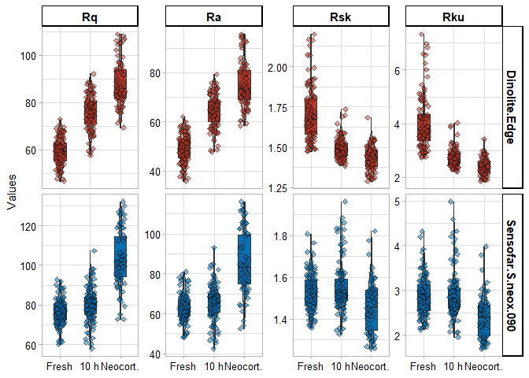
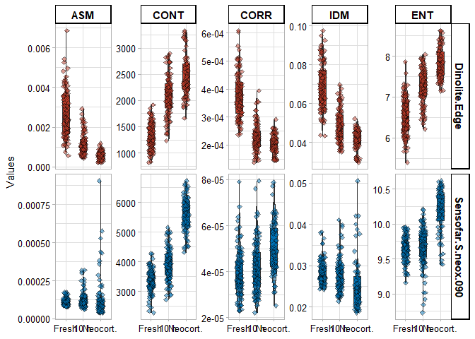
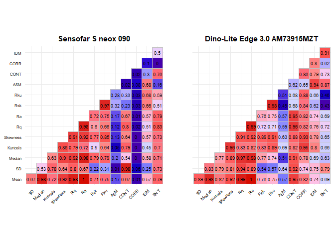
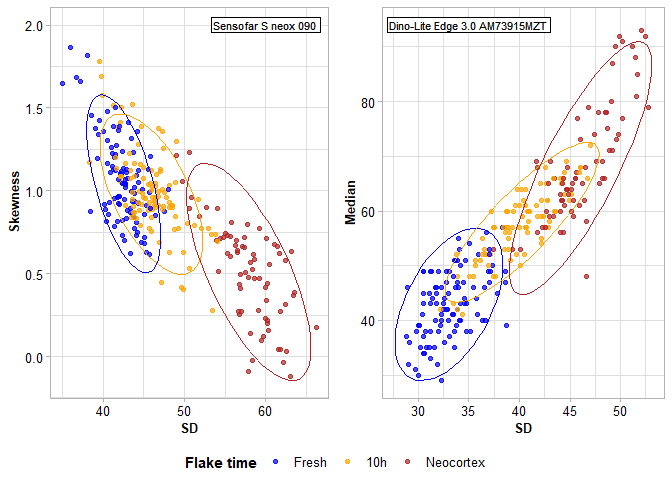

# Microscope agnosticism and the characterization of sedimentary abrasion of flint stone tools

Guillermo Bustos-Pérez $^{1,2,3}$, Andreu Olle $^{2,3}$

1)  Departament of Human Origins, Max Planck Institute for Evolutionary
    Anthropology, Leipzig.
2)  Departamento de Prehistoria y Arqueología, Universidad Autónoma de
    Madrid, Campus de Cantoblanco, 28049 Madrid, Spain
3)  Institut Català de Paleoecologia Humana i Evolució Social
    (IPHES-CERCA), Zona Educacional 4, Campus Sescelades URV (Edifici
    W3), 43007 Tarragona, Spain
4)  Universitat Rovira i Virgili, Departament d’Història i Història de
    l’Art, Avinguda de Catalunya 35, 43002 Tarragona, Spain

<div align="justify">

## Abstract

The surface of lithic stone tools from Paleolithic archaeological sites
can undergo a range of different postdepositional alterations, including
sedimentary erosion induced by water displacement or wind. The surface
of flint artifacts can reflect these alterations as changes in texture.
Microscopic analyses and grayscale images can be employed to obtain
quantitative data to help determine the degree to which the surfaces of
flint stone tools have been altered. However, surface quantitative
values depend directly on the image capturing system of each microscope.
This raises the question of whether the quantitative values are actually
capturing the evolution of the surface, whether they are dependent on
the type of microscope and its image capturing system, and whether the
detection of the degree of abrasion might vary depending on the type of
microscope. The present work sought to determine whether data extracted
from images from two different microscopes point to the same trends in
surface change due to postdepositional alterations. Surface photographs
of a sample of 25 flakes were taken using a Dino-Lite Edge 3.0
AM73915MZT and a 3D Optical Profiler Sensofar S neox 090. These flakes
represented three different stages of alteration (fresh, ten hours of
experimentally-induced sedimentary erosion, and geological neocortex).
Results from grayscale images indicate that, despite yielding different
numeric ranges, the quantitative values of the images from both types of
microscope reflect the same trends in surface change. The classification
accuracy of the three stages of erosion did not vary between
microscopes.

**Key words**: microscopic analysis; lithic analysis; lithic taphonomy;
postdepositional surface modifications

## 1) Introduction

Flint stone tools are among the most common remains recovered from
Paleolithic sites. They provide information not only about
chrono-cultural developments, but also about the behavioral and spatial
organization of Paleolithic groups. However, stone tools from
Paleolithic sites may be subjected to any number of postdepositional
alterations, most commonly water flow or wind abrasion
\[byers_flake_2015; Hosfield and Chambers
([2016](#ref-hosfield_flake_2016)); Michel et al.
([2019](#ref-michel_freezing_2019)); Petraglia and Potts
([1994](#ref-petraglia_water_1994)); Schick
([1986](#ref-schick_stone_1986))\]. These postdepositional processes can
disrupt archaeological remains, resulting in horizontal and vertical
mixing of artifacts and, consequently, unreliable chrono-cultural
interpretations. Therefore, a solid analysis of the integrity of a
lithic assemblage is needed prior to its interpretation.

Postdepositional alterations and their intensity are recorded on the
surface of stone tools, most commonly observed in the form of increased
ridge width and surface abrasion ([Burroni et al.,
2002](#ref-burroni_surface_2002); [Bustos-Pérez et al.,
2019](#ref-bustos-perez_experimental_2019); [Bustos-Pérez and Ollé,
2024](#ref-bustos-perez_quantification_2024); [Chambers,
2016](#ref-chambers_like_2016); [Shackley,
1974](#ref-shackley_stream_1974)). Unaided visual assessments of
sedimentary abrasion (rounding) can result in an error ratio of over
80%, emphasizing the need for microscopic analyses with quantitative
variables ([Chambers, 2016](#ref-chambers_like_2016)).

The quantitative characterization of surfaces is an important part of
many lithic microscopic analytical approaches. In recent traceological
studies, surface texture quantification is often used to identify worked
materials ([Evans and Donahue, 2008](#ref-evans_laser_2008); [Ibáñez et
al., 2019](#ref-ibanez_identifying_2019); [Ibáñez and Mazzucco,
2021](#ref-ibanez_quantitative_2021); [Macdonald,
2014](#ref-macdonald_application_2014); [Sferrazza,
2023](#ref-sferrazza_grey_2023); [Stemp and Chung,
2011](#ref-stemp_discrimination_2011); [Stevens et al.,
2010](#ref-stevens_practical_2010)) or test different models of polish
development ([Ibáñez and Mazzucco,
2021](#ref-ibanez_quantitative_2021)). Another area of lithic
microscopic analysis in which surface quantification plays a key role is
in the identification, characterization and estimation of the intensity
of postdepositional alterations on lithic artifacts ([Burroni et al.,
2002](#ref-burroni_surface_2002); [Bustos-Pérez et al.,
2019](#ref-bustos-perez_experimental_2019); [Caux et al.,
2018](#ref-caux_aspects_2018); [Chambers,
2016](#ref-chambers_like_2016); [Chu et al.,
2015](#ref-chu_micro-abrasion_2015); [Hiscock,
1985](#ref-hiscock_need_1985); [Hosfield et al.,
2000](#ref-hosfield_interpreting_2000); [Levi Sala,
1986](#ref-levi_sala_use_1986)). The development of these analyses has
been incorporated in studies focusing on the integrity of the lithic
artifacts in archaeological assemblages ([Fraile-Márquez et al.,
2022](#ref-fraile-marquez_facing_2022); [Galland et al.,
2019](#ref-galland_quantifying_2019); [Staurset et al.,
2023](#ref-staurset_post-depositional_2023)).

Recent approaches using sequential experimentation, grayscale images
([Bustos-Pérez and Ollé, 2024](#ref-bustos-perez_quantification_2024);
[Sferrazza, 2023](#ref-sferrazza_grey_2023)) and texture metrics
([Haralick et al., 1973](#ref-haralick_textural_1973)) have demonstrated
the viability of quantifying surface changes caused by sedimentary
abrasion on flint tools. However, the information contained in the
pixels of a photograph may vary according to the capturing system of
each microscope. This raises the issue of the importance of microscope
agnosticism (meaning that metric values or trends do not vary in
relation to the choice of microscope). In the present study, we explored
four aspects to explore the issue of microscope agnosticism in relation
to sedimentary abrasion.

1)  Observed trends in quantitative metrics should be consistent
    independent of the choice of microscope. The combination of
    sequential experimentation and quantitative metrics ([Bustos-Pérez
    and Ollé, 2024](#ref-bustos-perez_quantification_2024); [Ibáñez and
    Mazzucco, 2021](#ref-ibanez_quantitative_2021); [Ollé and Vergès,
    2014](#ref-olle_use_2014)) has resulted in a certain degree of
    confidence regarding how the surface of flint changes progressively
    as result of a mechanical action. However, the current understanding
    of this change is directly related to the image acquisition
    procedure and the quantitative variables derived from those images.
    Ideally, quantitative trends would remain consistent regardless of
    the type of microscope used.

2)  Collinearity or multicollinearity of metric features extracted from
    images should be considered. Several approaches ([Bustos-Pérez and
    Ollé, 2024](#ref-bustos-perez_quantification_2024); [Ibáñez and
    Mazzucco, 2021](#ref-ibanez_quantitative_2021); [Pedergnana et al.,
    2020](#ref-pedergnana_polish_2020); [Sferrazza,
    2023](#ref-sferrazza_grey_2023); [Stevens et al.,
    2010](#ref-stevens_practical_2010)) use machine learning (ML)
    classification algorithms on metric features extracted from images.
    Along with higher accuracy, one substantial advantage of ML
    algorithms is that they can provide insights into feature importance
    for classification. Collinearity is generally not considered
    problematic for classification metrics, provided that any
    collinearity present in the training set is also present in the
    predicted sample. However, collinearity is considered to have
    substantial effects on interpreting feature importance due to
    unstable coefficients or redundancy in feature selection. Thus, it
    is important to be aware of the presence of collinear or
    multicollinear variables when using quantitative features extracted
    from images. Images of the same area from different microscopes will
    vary depending on the image acquiring system, and as a consequence,
    the presence of collinearity among the extracted features is also
    expected to vary from microscope to microscope. A microscope
    generating images with fewer pairs of collinear variables can be
    considered more reliable for the quantitative characterization of a
    surface.

3)  Classification accuracy should remain similar despite the use of
    variables obtained from the images of different microscopes.
    Accuracy can be affected when multicollinearity is present among the
    variables. A common approach to this problem is the use of
    dimensionality reduction methods (PCA, t-SNE; Naes and Mevik
    ([2001](#ref-naes_understanding_2001))), which make it possible to
    combine multiple collinear variables while avoiding the loss of
    information. If multicollinearity is present, the accuracy of a
    model using raw variables should be compared with a model using
    dimensionally reduced variables.

4)  Consistency of variable importance among classification algorithms
    and photographs obtained from different microscopes is a good
    indicator of microscope agnosticism. However, as previously
    indicated, variable importance can be affected by collinearity among
    predictors. This is an important consideration since the importance
    of a pair of variables might be a result of their collinearity.
    Additionally, it makes it possible to consider which groups of
    metric variables should be emphasized when analyzing surface change
    due to a given mechanical action.

## 2) Methods

### 2.1) Experimental sample and cleaning protocol

The sample consisted of 25 flakes experimentally knapped by one of the
authors (GBP) using direct percussion with a hard hammer. The flakes
came from three different types of flint (Table 1), all of them south
Madrid Miocene flint ([Bustillo et al.,
2012](#ref-bustillo_caracterizacion_2012); [Bustillo and Pérez-Jiménez,
2005](#ref-bustillo_caracteristicas_2005)) from different locations.
South Madrid Miocene flints were formed by the replacement of
sedimentary rocks which had filled the original basin, which is thought
to have taken place under continental conditions such as alluvial plain
deposits, shallow lacustrine waters, and marshes ([Bustillo et al.,
2012](#ref-bustillo_caracterizacion_2012)). Macroscopic analysis of the
flints shows that they present a fine, opaque, homogeneous surface and
blue/grey and reddish/ocher coloration. There is also a relative absence
of opal in these flints, although geodes and pseudo-morphs are sometimes
present.

``` r
library(tidyverse); library(caret)
load("Data/Data-Both-micro-v3.RData")

Data %>% 
  group_by(Flint.Type, Flake.Time) %>% 
  summarise(n_distinct(Flake.ID))
```

    ## # A tibble: 6 × 3
    ## # Groups:   Flint.Type [3]
    ##   Flint.Type Flake.Time `n_distinct(Flake.ID)`
    ##   <chr>      <fct>                       <int>
    ## 1 GeoSample  Neocortex                       3
    ## 2 Type_1     Fresh                           5
    ## 3 Type_1     Ten.Hours                       4
    ## 4 Type_2     Fresh                           5
    ## 5 Type_2     Ten.Hours                       5
    ## 6 Type_2     Neocortex                       3

Five type 1 and 2 flakes were analyzed to obtain images of the fresh
surface, while four type 1 flakes and five type 2 flakes were submitted
to ten hours of rounding in a tumbling machine (KT-3010 SUPER-TUMBLER).
The sedimentary matrix employed to simulate rounding consisted of a mix
of sand and water (a total weight of 5 kg of which 30–40% was water).
Sediment was obtained from the quaternary levels of the Madrid basin and
was made up of fine quartz sands with silt and partial carbonation. The
tumbler machine was set at continuous direction at 83 rpm. The average
weight of the flakes introduced into the tumbler was 26.25 g.

Geological images of the neocortex were obtained from three type 3
flakes and three type 2 flakes (Table 2). These images of geological
neocortex serve as reference samples for extreme levels of sedimentary
abrasion.

<figure>

<figcaption aria-hidden="true">Sample of experimental materials before
and after 10h of sedimentary abrasion (photographs by M. D.
Guillén).</figcaption>
</figure>

Possible contaminants were removed by means of a multi-step procedure
based on a previous study \[Pedergnana et al.
([2016](#ref-pedergnana_modern_2016)). The present study used a two-step
procedure consisting of an ultrasonic bath (frequency of 40 kHz) in a 2%
neutral soap (Derquim) solution for 10 to 15 minutes, followed by a
second sonic bath in pure acetone for another 10 to 15 minutes. After
each step, the lithic artifacts were placed in a tap water bath and
finally dried using compressed air. During the cleaning protocol and
microscopic analysis, all artifacts were handled using powder-free
surgical gloves.

``` r
Data %>% group_by(Microscope, Flake.Time) %>% 
  summarise(Phot.Per.Time = n())
```

    ## `summarise()` has grouped output by 'Microscope'. You can override using the
    ## `.groups` argument.

    ## # A tibble: 6 × 3
    ## # Groups:   Microscope [2]
    ##   Microscope          Flake.Time Phot.Per.Time
    ##   <chr>               <fct>              <int>
    ## 1 Dinolite.Edge       Fresh                100
    ## 2 Dinolite.Edge       Ten.Hours             87
    ## 3 Dinolite.Edge       Neocortex             71
    ## 4 Sensofar.S.neox.090 Fresh                100
    ## 5 Sensofar.S.neox.090 Ten.Hours            105
    ## 6 Sensofar.S.neox.090 Neocortex             71

### 2.2) Image acquisition and processing

In order to compare images, the field of view (FOV) and pixel ratio of
both microscopes must be as similar as possible. Parameters of the
Dino-Lite Edge 3.0 AM73915MZT were kept the same as in previous
experiments ([Bustos-Pérez and Ollé,
2024](#ref-bustos-perez_quantification_2024)), with a FOV of 3.28 x 2.46
mm and a pixel ratio of 2548 x 1918. As a result, each pixel measured
1.28 μm (width) by 1.28 μm (height). The Dino-Lite Edge 3.0 AM73915MZT
microscope was mounted in a Dino-Lite RK-06-AE stand in order to ensure
verticality, and a N3C-D2 diffuser cap was used to ensure the even
distribution of light. In the process of taking each photograph, the
region of interest on the flint was manually positioned as horizontally
as possible ([Calandra et al., 2022](#ref-calandra_surface_2022)). To
avoid problems due to focus variation, each surface was photographed
several times at different heights, and the sequences obtained were
mounted using a Helicon Focus 7.7.2. Normally, satisfactory stacking
required between two and four images, although additional images were
employed when needed.

<figure>

<figcaption aria-hidden="true">Example of two images from the same
neocortex surface. Left: Sensofar S neox 090; right: Dino-Lite Edge 3.0
AM73915MZT. Both images after processing using Fiji/ImageJ</figcaption>
</figure>

The Sensofar S neox 090 zoom was manually adjusted to the most similar
FOV (3.18 x 2.65 mm) with 2x2 mosaics taken for each image. All images
were obtained using a x10 objective lens (numerical aperture 0.30) in
light scanning confocal mode (microdisplay scanning confocal microscopy)
at 5 Mp resolution with at least 95% of the information retrieved. The
original Sensofar S neox 090 photographs had a pixel ratio of 4616 x
3848. This resulted in each pixel measuring 0.69 x 0.69 μm. In order to
match the FOV and pixel ratio of the Sensofar S neox 090 zoom to those
of MP previous studies ([Bustos-Pérez and Ollé,
2024](#ref-bustos-perez_quantification_2024)), the images were cropped
and the pixels downsampled. Although the images from the Dino-Lite Edge
3.0 AM73915MZT microscope were slightly wider (0.10 mm), this resulted
in almost identical FOV, pixel ratios and pixel widths/heights (Table
3).

Both sets of images underwent the same two-step image treatment
procedure employed in a previous study ([Bustos-Pérez and Ollé,
2024](#ref-bustos-perez_quantification_2024)). First, the Fiji
([Schindelin et al., 2015](#ref-schindelin_imagej_2015)) “subtract
background” plugin was used to minimize the effects of different
lighting and differing flint coloration. Second, the “enhance contrast”
function was used to desaturate the images by normalizing their
histograms. This process provided a gray-level image for use as input
for the statistical analysis. All analyzed images were in TIFF format.

 

  

  

Photographs of fresh and neocortex surfaces were obtained in the same
areas with both microscopes. The surface of the flakes that had
undergone 10h of rounding was initially recognized with both types of
microscopes and the most-developed surfaces were photographed. This is a
common procedure when analyzing microscopic traces, as the
most-developed area ([Ibáñez and Mazzucco,
2021](#ref-ibanez_quantitative_2021); [Pedergnana et al.,
2020](#ref-pedergnana_polish_2020)) is targeted for photography. This
ensured the maximum visibility of the abrasion for each microscope.

``` r
kableExtra::kable(
  data.frame(
  `Microscope images` = c("AM73915MZT", "S neox 090 (original images)", "S neox 090(transformed)"),
  `Image aspect ratio` = c(1.33, 1.19, 1.33),
  `FOV (mm)` = c("3.28 x 2.46", "3.18 x 2.65", "3.18 x 2.46"),
  `Pixel Ratio` = c("2548 x 1918", "4616 x 3848", "2480 x 1918"),
  `Pixel width height (μm)` = c("1.28 x 1.28", "0.69 x 0.69", "1.28 x 1.28"))
) 
```

| Microscope.images            | Image.aspect.ratio | FOV..mm.    | Pixel.Ratio | Pixel.width.height..μm. |
|:-----------------------------|-------------------:|:------------|:------------|:------------------------|
| AM73915MZT                   |               1.33 | 3.28 x 2.46 | 2548 x 1918 | 1.28 x 1.28             |
| S neox 090 (original images) |               1.19 | 3.18 x 2.65 | 4616 x 3848 | 0.69 x 0.69             |
| S neox 090(transformed)      |               1.33 | 3.18 x 2.46 | 2480 x 1918 | 1.28 x 1.28             |

### 2.3) Quantitative analysis

Three groups of metrics were extracted from the microscope images (Table
4). The first group corresponds to descriptive statistics of the
gray-level values in each image, which can be divided into measures of
central tendency (mean, mode and median), and measures of deviation and
distribution (standard deviation, kurtosis and skewness).

``` r
kableExtra::kable(
  data.frame(
  Name = c("Mean", "Mode", "Median", "Standard Deviation", "Skewness", "Kurtosis", "RMS deviation/roughness", "Arithmetical mean deviation", "Skewness assessed profile", "Kurtosis assessed profile", "Angular second moment", "Contrast", "Correlation", "Inverse different moment", "Entropy"),
  Acronym = c("x̄", "Mo", "m", "SD", "Sk", "Ku", "Rq", "Ra", "Rsk", "Rku", "ASM", "CONT", "CORR", "IDM", "ENT"),
  Group = c("C", "C", "C", "D&D", "D&D", "D&D", "R", "R", "R", "R", "T", "T", "T", "T", "T"),
  Description = c("Central tendency of the sample", "Most repeated value", "Value of at least half the sample", "Variation expected from the mean", "Asymmetry of the distribution", "Tailedness of the distribution", "Indicator of surface roughness", "Deviation of a surface from a mean height", "Indicator of the departure from surface symmetry", "Sharpness of the peaks", "Measure of homogeneity in the image", "Indicative of local variations", "How a reference pixel is related to its neighbor", "Closeness of the distribution of the GLCM elements to the GLCM diagonal.", "Amount of irremediable chaos or disorder in an image")
  )
)
```

| Name                        | Acronym | Group | Description                                                              |
|:----------------------------|:--------|:------|:-------------------------------------------------------------------------|
| Mean                        | x̄       | C     | Central tendency of the sample                                           |
| Mode                        | Mo      | C     | Most repeated value                                                      |
| Median                      | m       | C     | Value of at least half the sample                                        |
| Standard Deviation          | SD      | D&D   | Variation expected from the mean                                         |
| Skewness                    | Sk      | D&D   | Asymmetry of the distribution                                            |
| Kurtosis                    | Ku      | D&D   | Tailedness of the distribution                                           |
| RMS deviation/roughness     | Rq      | R     | Indicator of surface roughness                                           |
| Arithmetical mean deviation | Ra      | R     | Deviation of a surface from a mean height                                |
| Skewness assessed profile   | Rsk     | R     | Indicator of the departure from surface symmetry                         |
| Kurtosis assessed profile   | Rku     | R     | Sharpness of the peaks                                                   |
| Angular second moment       | ASM     | T     | Measure of homogeneity in the image                                      |
| Contrast                    | CONT    | T     | Indicative of local variations                                           |
| Correlation                 | CORR    | T     | How a reference pixel is related to its neighbor                         |
| Inverse different moment    | IDM     | T     | Closeness of the distribution of the GLCM elements to the GLCM diagonal. |
| Entropy                     | ENT     | T     | Amount of irremediable chaos or disorder in an image                     |

The second group corresponds to measures of roughness. The Fiji/ImageJ
([Collins, 2007](#ref-collins_imagej_2007); [Schindelin et al.,
2015](#ref-schindelin_imagej_2015), [2012](#ref-schindelin_fiji_2012))
SurfCharJ plugin ([Chinga et al.,
2007](#ref-chinga_quantification_2007); [Chinga and Dougherty,
2002](#ref-chinga_roughness_2002)) was employed to obtain measures of Rq
(root mean square deviation/roughness), Ra (arithmetical mean
deviation), Rsk (skewness of the assessed profile) and Rku (kurtosis of
the assessed profile). Profiles of the whole surface (those with the “R”
prefix) were employed as input, and measures were calculated following
the ISO 4287/2000 standard ([Chinga et al.,
2007](#ref-chinga_quantification_2007); [Chinga and Dougherty,
2002](#ref-chinga_roughness_2002)).

Texture measures take into consideration the spatial distribution and
intensity values of the pixels from a grayscale image ([Haralick et al.,
1973](#ref-haralick_textural_1973)). The spatial distribution and
intensity are analyzed through a gray-level covariance matrix (GLCM).
This process works in two steps. First, for a given distance and
direction, a matrix is built that captures the relationship of intensity
between pairs of pixels (reference and neighbor). Second, for every x
and y it considers the co-occurrence of values, forming a new matrix.
This matrix makes it possible to obtain a series of statistical
descriptors ([Haralick et al., 1973](#ref-haralick_textural_1973)): the
angular second moment (ASM), contrast (CONT), correlation (CORR),
inverse different moment (IDM) and entropy (ENT). Based on previous
studies ([Bustos-Pérez and Ollé,
2024](#ref-bustos-perez_quantification_2024)), four distances (5, 10, 15
and 20 pixels) and all four possible directions (north, east, south,
west) were employed to create the GLCM and extract the features.

Two procedures were used to address the issue of collinearity among the
predictors. The first of these was the removal of collinear variables
using a pairwise cutoff discard procedure with a matrix representing the
linear correlation ($r^2$) of each pair of variables. For pairs of
variables presenting a correlation above a given threshold, the variable
presenting the highest average correlation (among all variables) was
removed. An arbitrary cutoff threshold of 0.9 was selected. A visual
evaluation of variable relationships showed that this threshold
prevented the exclusion of pairs of variables presenting polynomial or
logarithmic relationships. In the second procedure, dimensionality was
reduced through a principal component analysis (PCA), which identifies
the linear combinations that best represent the variables in an
unsupervised manner ([James et al., 2013](#ref-james_introduction_2013);
[Pearson, 1901](#ref-pearson_lines_1901)). Principal components (PCs)
capture as much variance as possible for the complete dataset. This is
especially useful when several collinear variables will be combined as a
single variable, as it ensures a minimum loss of information ([James et
al., 2013](#ref-james_introduction_2013); [Yang and Yang,
2003](#ref-yang_why_2003)). Consistency among the variable trend of data
from both microscopes was evaluated through visual exploratory analysis
and statistical differences between each consecutive episode of
abrasion.

A previous study ([Bustos-Pérez and Ollé,
2024](#ref-bustos-perez_quantification_2024)) using the same type of
metrics showed that the linear discriminant analysis (LDA) provided the
best results for classification. LDA reduces the dimensionality of the
data aiming to maximize the separation between classes while decision
boundaries divide the predicted classes into regions ([Fisher,
1936](#ref-fisher_use_1936); [James et al.,
2013](#ref-james_introduction_2013)). In the present study, three sets
of LDA models were trained for each group of images. The first model was
trained using the complete set of variables, second model was trained
using the set of variables remaining from the pairwise cutoff to avoid
collinearity, and the third model was trained after conducting a PCA for
dimensionality reduction.  
All models were evaluated using 10 x 50 k-fold cross-validation (10
folds and 50 cycles), which provided measures of accuracy. Using a
10-fold division, each fold from the Dino-Lite Edge 3.0 AM73915MZT
images was composed of 26 images, while each fold from Sensofar S neox
090 was composed of 28 images. Each fold subsequently acted as a test
set for a trained model. Although computationally more expensive, this
guaranteed that all data points served as test sets. At the start of
each of the 50 cycles, and prior to fold division, the images were
randomly shuffled, ensuring that the composition of the folds varied in
each cycle and that composition did not play a significant role in the
evaluation of the models.  
Two measures were selected for the evaluation of the machine learning
models: accuracy and area under the curve (AUC). Accuracy indicates the
success rate of a model, representing the proportion of times in which a
class was correctly identified ([Lantz, 2019](#ref-lantz_machine_2019)).
Accuracy is usually calculated using a 0.5 threshold for class
assignation. However, classification thresholds can be modified to
balance the ability of the model to detect true positives and avoid
false positives (sensitivity and specificity). The receiver operating
characteristic (ROC) curve makes it possible to systematically evaluate
the ratio of detected true positives, while avoiding false positives,
for a given threshold ([Bradley, 1997](#ref-bradley_use_1997);
[Spackman, 1989](#ref-spackman_signal_1989)). The ROC curve makes it
possible to calculate the area under the curve (AUC) with a value that
can range from 1 (perfect classifier) to 0, and a value of 0.5
representing a random classifier. In the present study, only the general
AUC value of model performance was considered. The general AUC was
calculated from the average of each AUC class ([Hand and Till,
2001](#ref-hand_simple_2001); [Robin et al.,
2011](#ref-robin_proc_2011)).  
Machine learning models make it possible to estimate the importance of
variables for classification. In the present study, variable importance
was calculated only for LDA models trained on non-collinear sets of
variables.

The statistical study was conducted using R version 4.3.1 in the IDE
RStudio version 2023.09.0 ([R. C. Team, 2019](#ref-r_core_team_r_2019);
[Rs. Team, 2019](#ref-rstudio_team_rstudio_2019)). Data were managed and
graphs created using the tidyverse v.2.0.0 package ([Wickham et al.,
2019](#ref-wickham_welcome_2019)). LDA models were trained using MASS
(Modern Applied Statistics with S) v.7.3.60 ([Venables and Ripley,
2002](#ref-venables_modern_2002)). The k-fold cross validation of all
models, precision metrics, the pairwise discard of collinear variables,
and variable importance were performed using the caret package v.6.0.94
([Kuhn, 2008](#ref-kuhn_building_2008)). ROC curves and AUC values were
obtained using the pROC v.1.18.5 package ([Robin et al.,
2011](#ref-robin_proc_2011)).  
Currently, all data, code and the complete workflow needed to perform
the analysis is made freely available as an open repository at Github
using an RMarkdown document ([Xie et al., 2018](#ref-xie_r_2018); [Xie,
2014](#ref-xie_knitr_2014)). If the current draft is accepted for
publication, the repository will be made available at Zenodo.

## 3) Results

### 3.1) Trends of metric variables

    Table 5 summarizes the observed trends and consistency between microscopes for the variables employed in the analysis. Images from the Dino-Lite Edge 3.0 AM73915MZT show clear trends for all variables and for all three stages of mechanical action considered. The interpretation of the images from the Sensofar S neox 090 was not nearly as clear, with no statistical differences between stages of abrasion for several of the variables.    

Clear consistency between microscopes was observed for seven variables
(mean of pixel values, standard deviation, Sk, Ku, Rq, Ra and CONT) in
the form of the same trends and marked statistical differences between
values of variables according to stage of abrasion. Two additional
variables (median and CORR) presented p values at the limit of
significant statistical difference, with the presence of several
outliers obfuscating the apparent trends among values.

``` r
kableExtra::kable(
  data.frame(
  Feature = c("x̄", "Mo", "m", "SD", "Sk", "Ku", "Rq", "Ra", "Rsk", "Rku", "ASM", "CONT", "CORR", "IDM", "ENT"),
  Sensofar = c("Increase", "Increase", "No trend", "Increase", "Decrease", "Decrease", "Increase", "Increase", "No trend", "No trend", "No trend", "Increase", "Increase", "No trend", "No trend"),
  Dinolite = c("Increase", "Increase", "Increase", "Increase", "Decrease", "Decrease", "Increase", "Increase", "Decrease", "Decrease", "Decrease", "Increase", "Decrease", "Decrease", "Increase"),
  Consistency = c("Yes", "Yes", "No", "Yes", "Yes", "Yes", "Yes", "Yes", "No", "No", "No", "Yes", "Yes", "No", "No"))
  )
```

| Feature | Sensofar | Dinolite | Consistency |
|:--------|:---------|:---------|:------------|
| x̄       | Increase | Increase | Yes         |
| Mo      | Increase | Increase | Yes         |
| m       | No trend | Increase | No          |
| SD      | Increase | Increase | Yes         |
| Sk      | Decrease | Decrease | Yes         |
| Ku      | Decrease | Decrease | Yes         |
| Rq      | Increase | Increase | Yes         |
| Ra      | Increase | Increase | Yes         |
| Rsk     | No trend | Decrease | No          |
| Rku     | No trend | Decrease | No          |
| ASM     | No trend | Decrease | No          |
| CONT    | Increase | Increase | Yes         |
| CORR    | Increase | Decrease | Yes         |
| IDM     | No trend | Decrease | No          |
| ENT     | No trend | Increase | No          |

Visual analysis of the values in box plots makes it possible compare the
evolution of trends among the different groups of variables and compare
microscope consistency (Figure 5; Figure 6; Figure 7; Figure 8). A
tendency of increasing values was observed among the three measures of
central tendency in the Dino-Lite Edge 3.0 AM73915MZT images (Figure 5).
The images of geological neocortex from the Sensofar S neox 090 tended
to have higher mean and median values than images of fresh flakes and
those exposed to 10 hours of abrasion. However, no statistical
difference was found between the median values of the images of fresh
flint images and those of flakes after 10 hours of rounding (t = -0.73;
p = 0.46), although there was a statistical difference for the mean
values of the same two categories (t = -9.80; p \< 0.01). As expected,
the modal of the distribution was the least reliable variable, with the
mode consistently having a value of 0 for all Sensofar S neox 090
images.

``` r
Data %>% 
  select(Mean, Modal, Median, Flake.Time, Microscope) %>% 
  pivot_longer(
    Mean:Median,
    names_to = "Variables",
    values_to = "values") %>% 
  mutate(Variables = factor(Variables, levels = c("Mean", "Median", "Modal")),
         Flake.Time = factor(Flake.Time, levels = c("Fresh", "Ten.Hours", "Neocortex"),
                             labels = c("Fresh", "10 h", "Neocortex"))) %>% 
  
  ggplot(aes(Flake.Time, values, fill = Microscope)) +
  theme_light() +
  geom_violin(width = 0.4, alpha = 0.5) +
  geom_boxplot(outlier.shape = NA, outlier.colour = NA,  width = 0.4) +
  xlab(NULL) +
  ylab("Values") +
  ggsci::scale_fill_nejm() +
  geom_jitter(aes(fill = Microscope), width = 0.15, height = 0, 
              shape = 23, alpha = 0.5, color = "black") +
  ggh4x::facet_grid2(Microscope ~ Variables,
                     scales = "free_y", independent = "y") +
  theme(
    legend.position = "none",
    strip.text = element_text(color = "black", face = "bold", size = 11),
    strip.background = element_rect(fill = "white", colour = "black", linewidth = 1),
    axis.text = element_text(color = "black", size = 10)
  )
```

<!-- -->

The images from both microscopes demonstrated a much better trend
consistency for variables capturing the deviation and distribution of
values (Figure 6). Standard deviation and kurtosis showed marked
statistically significant trends (increase and decrease respectively)
for both types of microscopes. The skewness values of the Sensofar S
neox 090 images for fresh flint and flint subjected to 10 hours of
rounding presented slight statistical differences (t = 2.15; p = 0.03).

``` r
Data %>% 
  select(SD, Skewness, Kurtosis, Flake.Time, Microscope) %>% 
  pivot_longer(
    SD:Kurtosis,
    names_to = "Variables",
    values_to = "values") %>% 
  mutate(Variables = factor(Variables, levels = c("SD", "Skewness", "Kurtosis")),
         Flake.Time = factor(Flake.Time, levels = c("Fresh", "Ten.Hours", "Neocortex"),
                             labels = c("Fresh", "10 h", "Neocortex"))) %>% 
  
  ggplot(aes(Flake.Time, values, fill = Microscope)) +
  theme_light() +
  geom_violin(width = 0.4, alpha = 0.5) +
  geom_boxplot(outlier.shape = NA, outlier.colour = NA,  width = 0.4) +
  xlab(NULL) +
  ylab("Values") +
  ggsci::scale_fill_nejm() +
  geom_jitter(aes(fill = Microscope), width = 0.15, height = 0, 
              shape = 23, alpha = 0.5, color = "black") +
  ggh4x::facet_grid2(Microscope ~ Variables,
                     scales = "free_y", independent = "y") +
  theme(
    legend.position = "none",
    strip.text = element_text(color = "black", face = "bold", size = 11),
    strip.background = element_rect(fill = "white", colour = "black", linewidth = 1),
    axis.text = element_text(color = "black", size = 10)
  )
```

<!-- -->

Only two features of roughness were consistent between the two
microscopes (Rq and Ra). Images from the Dino-Lite Edge 3.0 AM73915MZT
showed a clear trend of increasing values as sedimentary abrasion
progresses. This trend was less marked in the Sensofar S neox 090
images, although there were statistically significant differences in Rq
values (t = -3.86, p \< 0.01) between fresh flint and flint subjected to
ten hours of rounding. The statistical significance between these stages
of sedimentary abrasion was less marked for the Ra values (t = -2.21, p
= 0.02). Although Rsk, and Rku presented clear trends of diminishing
values in the case of the Dino-Lite Edge 3.0 AM73915MZT images, no
statistically significant difference was observed between fresh flint
values and those of flint after 10 hours of rounding for the Sensofar S
neox 090 images (t = -1.42, p = 0.16; t = -0.47, p = 0.64).

``` r
Data %>% 
  select(Rq:Rku, Flake.Time, Microscope) %>% 
  pivot_longer(
    Rq:Rku,
    names_to = "Variables",
    values_to = "values") %>% 
  mutate(Variables = factor(Variables, levels = c("Rq", "Ra", "Rsk", "Rku")),
         Flake.Time = factor(Flake.Time, levels = c("Fresh", "Ten.Hours", "Neocortex"),
                             labels = c("Fresh", "10 h", "Neocort."))) %>% 
  
  ggplot(aes(Flake.Time, values, fill = Microscope)) +
  theme_light() +
  geom_violin(width = 0.4, alpha = 0.5) +
  geom_boxplot(outlier.shape = NA, outlier.colour = NA,  width = 0.4) +
  xlab(NULL) +
  ylab("Values") +
  ggsci::scale_fill_nejm() +
  geom_jitter(aes(fill = Microscope), width = 0.15, height = 0, 
              shape = 23, alpha = 0.5, color = "black") +
  ggh4x::facet_grid2(Microscope ~ Variables,
                     scales = "free_y", independent = "y") +
  theme(
    legend.position = "none",
    strip.text = element_text(color = "black", face = "bold", size = 11),
    strip.background = element_rect(fill = "white", colour = "black", linewidth = 1),
    axis.text = element_text(color = "black", size = 10)
  )
```

<!-- -->

``` r
Data %>% 
  select(ASM:ENT, Flake.Time, Microscope) %>% 
  pivot_longer(
    ASM:ENT,
    names_to = "Variables",
    values_to = "values") %>% 
  mutate(Variables = factor(Variables, levels = c("ASM", "CONT", "CORR", "IDM", "ENT")),
         Flake.Time = factor(Flake.Time, levels = c("Fresh", "Ten.Hours", "Neocortex"),
                             labels = c("Fresh", "10 h", "Neocort."))) %>% 
  
  ggplot(aes(Flake.Time, values, fill = Microscope)) +
  theme_light() +
  geom_violin(width = 0.4, alpha = 0.5) +
  geom_boxplot(outlier.shape = NA, outlier.colour = NA,  width = 0.4) +
  xlab(NULL) +
  ylab("Values") +
  ggsci::scale_fill_nejm() +
  geom_jitter(aes(fill = Microscope), width = 0.15, height = 0, 
              shape = 23, alpha = 0.5, color = "black") +
  ggh4x::facet_grid2(Microscope ~ Variables,
                     scales = "free_y", independent = "y") +
  theme(
    legend.position = "none",
    strip.text = element_text(color = "black", face = "bold", size = 11),
    strip.background = element_rect(fill = "white", colour = "black", linewidth = 1),
    axis.text = element_text(color = "black", size = 10)
  )
```

<!-- -->

One of the textural features (CONT) presented good consistency of trend
evolution in images from both microscopes (Figure 8), and a relatively
good pattern was observed in a second such feature (CORR). Images from
both microscopes presented a decrease in angular second moment (ASM)
values, although this decrease was much more pronounced among the images
obtained from the Dino-Lite Edge 3.0 AM73915MZT. For the Sensofar S neox
090, there was a statistically significant difference between the images
of fresh flint and flint after 10 hours of rounding (t = -2.04, p =
0.04), although this significance was not present in images of flint
after 10 hours of rounding and neocortex (t = -0.79, p = 0.43), which
may be the result of the presence of abundant outliers in the neocortex
category. Contrast (CONT) presented the best example of consistency of
all the variables, with the values of images from both microscopes
presenting a clear increasing trend as sedimentary abrasion increased.
Correlation (CORR) presented the clearest example of an inverse trend
between the microscopes. Values of images from the Sensofar S neox 090
showed a clear increasing trend (within a wide range of distribution),
while values from the Dino-Lite Edge 3.0 AM73915MZT images showed a
decreasing trend and more concentrated values.

Inverse different moment (IDM) showed a decrease in values for both
groups of images, although the neocortex images from the Sensofar S neox
090 presented a wider range of distribution values, with no significant
difference between fresh fling and flint after 10 hours of abrasion (t =
1.37; p = 0.17). No statistically significant difference was found
between fresh flint and flint after 10 hours of abrasion in the Sensofar
S neox 090 images (t = -1.2, p = 0.23) for entropy (ENT) either.

### 3.2) Collinearity among features

Figure 9 presents the results of correlation pairs between features for
both types of microscopes. In general, a high level of correlation was
observed among the features for both microscopes. For both microscopes,
ASM presented very little correlation with other variables. The CORR
feature presented little systematic correlation in the case of images
from the Sensofar S neox 090 microscope, and ENT also presented little
systematic correlation for the images from the Dino-Lite Edge 3.0
AM73915MZT microscope.  
The Sensofar S neox 090 presented nine variables exceeding the r2 = 0.9
cut-off threshold (standard deviation, median, Ku, Sk, Rsk, ASM, CORR,
IDM and ENT), while the Dino-Lite Edge 3.0 AM73915MZT presented seven
features below the cut-off threshold (median, modal, standard deviation,
Rsk, ASM, CORR and ENT).

``` r
#### Collinearity plot of Sensofar images (91 possible combinations) ####
Data2 <- Data %>% filter(Microscope == "Sensofar.S.neox.090") %>% 
  select(-c(Modal))

r2 <- cor(Data2[,2:15], use = "complete.obs")^2
r2 <- round(r2,2)

### Correlation of dinolite variables (91 possible combinations) ####
Data3 <- Data %>% filter(Microscope == "Dinolite.Edge") %>% 
  select(-c(Modal))

r3 <- cor(Data3[, 2:15], use = "complete.obs")^2
r3 <- round(r3, 2)

((sum(r3 >= 0.9)-ncol(r3)))/2 # 22 pairs present correlation levels above 0.9
```

    ## [1] 22

``` r
# Sort out correlated variables from the Dinolite
df.Test = cor(Data3[,2:15],  use = "complete.obs")^2
hc = findCorrelation(df.Test, cutoff = 0.9, names = TRUE,
                     exact = TRUE) 

reduced_Data = Data3 %>% select(-all_of(hc))
head(reduced_Data)
```

    ##                              ID      SD Median   Rsk          ASM         CORR
    ## 1  HDisc_02_01 Neocortex 1.tif  49.4677     90 1.308 0.0003087312 0.0001629269
    ## 2 HDisc_02_01 Neocortex 10.tif  51.6747     85 1.343 0.0002716125 0.0001463619
    ## 3  HDisc_02_01 Neocortex 2.tif  50.1672     91 1.302 0.0003179688 0.0001460925
    ## 4  HDisc_02_01 Neocortex 3.tif  51.1694     90 1.316 0.0003040437 0.0001538169
    ## 5  HDisc_02_01 Neocortex 4.tif  49.2329     87 1.333 0.0002877750 0.0001553200
    ## 6  HDisc_02_01 Neocortex 5.tif  51.5332     81 1.379 0.0002437063 0.0001499881
    ##        ENT    Flake.ID Flake.Number Flint.Type Flake.Time Dorsal.Ventral
    ## 1 8.335275 HDisc_02_01           01  GeoSample  Neocortex             01
    ## 2 8.441850 HDisc_02_01           01  GeoSample  Neocortex             01
    ## 3 8.292125 HDisc_02_01           01  GeoSample  Neocortex             01
    ## 4 8.316675 HDisc_02_01           01  GeoSample  Neocortex             01
    ## 5 8.394769 HDisc_02_01           01  GeoSample  Neocortex             01
    ## 6 8.565931 HDisc_02_01           01  GeoSample  Neocortex             01
    ##   No.Photo    Microscope case_when(...)
    ## 1        1 Dinolite.Edge  Dinolite.Edge
    ## 2        0 Dinolite.Edge  Dinolite.Edge
    ## 3        2 Dinolite.Edge  Dinolite.Edge
    ## 4        3 Dinolite.Edge  Dinolite.Edge
    ## 5        4 Dinolite.Edge  Dinolite.Edge
    ## 6        5 Dinolite.Edge  Dinolite.Edge

``` r
#### Two graphs together ####
ggpubr::ggarrange(
  
  (
    ggcorrplot::ggcorrplot(r2, 
                           type = "lower",
                           lab = TRUE,
                           title = "Sensofar S neox 090",
                           tl.cex = 6,
                           lab_size = 2.3) +
      ggsci::scale_fill_gsea(reverse = FALSE) +
      theme(legend.position = "none",
            plot.title = element_text(hjust = 0.5, size = 11, face = "bold"),
            axis.text = element_text(color = "black", size = 12))
  ),
  (
    ggcorrplot::ggcorrplot(r3, 
                           type = "lower",
                           lab = TRUE,
                           title = "Dino-Lite Edge 3.0 AM73915MZT",
                           tl.cex = 6,
                           lab_size = 2.3) +
      ggsci::scale_fill_gsea(reverse = FALSE) +
      theme(legend.position = "none",
            axis.text.y = element_blank(),
            plot.title = element_text(hjust = 0.5, size = 11, face = "bold"),
            axis.text = element_text(color = "black", size = 12))
  ),
  
  nrow = 1,
  ncol = 2,
  align = "hv"
)
```

    ## Scale for fill is already present.
    ## Adding another scale for fill, which will replace the existing scale.
    ## Scale for fill is already present.
    ## Adding another scale for fill, which will replace the existing scale.

<!-- -->

### 3.3) LDA accuracy

Dimensionality reduction through PCAs resulted in PC1 capturing 99.97%
of variance for the set of images from both microscopes. PC2 captured
0.028% of variance for the Sensofar S neox 090 images and 0.022% of
variance for the Dino-Lite Edge 3.0 AM73915MZT images.

The following script allows to train the three types of models (all
features, reduced number of features and PCA):

``` r
source("13-Training-LDA-models.R")
```

``` r
load("Models/Dinolite-LDA-models.RData")
load("Models/Sensofar-LDA-models.RData")
```

Table 6 presents the results of LDA models for the three different sets
of variables selected (complete set of variables, non-collinear
variables and first three PCs) by microscope. In general, all models
presented outstanding AUC values, and differences between model
performance were minimal.

``` r
kableExtra::kable(
  data.frame(
  Variables = c("Complete", "Complete", "Non-Collinear", "Non-Collinear", "PCs", "PCs"),
  Metric = c("Accuracy", "AUC", "Accuracy", "AUC", "Accuracy", "AUC"),
  Sensofar = c(Senso.LDA$results[[2]], pROC::multiclass.roc(Senso.LDA$pred$obs, Senso.LDA$pred[,4:6])$auc[[1]],
               Senso.Reduced.LDA$results[[2]], pROC::multiclass.roc(Senso.Reduced.LDA$pred$obs, Senso.Reduced.LDA$pred[,4:6])$auc[[1]],
               Senso.PCA.LDA$results[[2]], pROC::multiclass.roc(Senso.PCA.LDA$pred$obs, Senso.PCA.LDA$pred[,4:6])$auc[[1]]),
  Dinolite = c(Dino.LDA$results[[2]], pROC::multiclass.roc(Dino.LDA$pred$obs, Dino.LDA$pred[,4:6])$auc[[1]],
               Dino.Reduced.LDA$results[[2]], pROC::multiclass.roc(Dino.Reduced.LDA$pred$obs, Dino.Reduced.LDA$pred[,4:6])$auc[[1]],
               Dino.PCA.LDA$results[[2]], pROC::multiclass.roc(Dino.PCA.LDA$pred$obs, Dino.PCA.LDA$pred[,4:6])$auc[[1]])
    )
) 
```

| Variables     | Metric   |  Sensofar |  Dinolite |
|:--------------|:---------|----------:|----------:|
| Complete      | Accuracy | 0.8528299 | 0.8903333 |
| Complete      | AUC      | 0.9568968 | 0.9774787 |
| Non-Collinear | Accuracy | 0.8507031 | 0.8591456 |
| Non-Collinear | AUC      | 0.9558560 | 0.9625366 |
| PCs           | Accuracy | 0.8103790 | 0.7459228 |
| PCs           | AUC      | 0.9444111 | 0.9110371 |

In the Sensofar S neox 090 images, no differences were observed between
the classification metrics of the LDA model using the complete set of
variables (accuracy = 0.853; AUC = 0.957) and the LDA model using
non-collinear variables (accuracy = 0.851; AUC = 0.956). The accuracy of
the LDA model trained on PCs was slightly lower (0.810), although the
AUC value was practically equal to that of the other models (0.944). The
LDA model trained on the whole set of variables from the Dino-Lite Edge
3.0 AM73915MZT images presented slightly higher values than the other
models (accuracy = 0.89; AUC = 0.977). The LDA model trained on
non-collinear variables and PCs using the Dino-Lite Edge 3.0 AM73915MZT
images presented very similar accuracy (0.859 and 0.844) and AUC values
(0.963 and 0.949).

### 3.4) Feature importance

Mean variable importance is presented in Figure 10. In general, there
was good consistency in variable importance for classification, as
standard deviation was considered the most important variable for
classification in both sets of images. It is important to consider that
the standard deviation was strongly correlated with the CONT textural
feature in both groups of images (r2 = 0.98 and 0.92). This indicates
that the degree of deviation in general (standard deviation) and in
local space (CONT) is highly important in the characterization of
abraded flint surfaces. The following second and third most important
variables for the Sensofar S neox 090 group of images were kurtosis and
skewness. For the Dino-Lite Edge 3.0 AM73915MZT images, kurtosis and
skewness were strongly correlated with the CORR textural feature (r2 =
0.95 and 0.93), which is considered the second most important variable.

``` r
# Extract as data frame
Sens.Feat.Impo <- data.frame(varImp(Senso.Reduced.LDA, scale = TRUE)$importance)
Sens.Feat.Impo <- Sens.Feat.Impo %>% mutate(
  Variable = rownames(Sens.Feat.Impo),
  Mean.Importance = rowMeans(Sens.Feat.Impo[,1:3]))

# Calculate mean importance
Dino.Feat.Impo <- data.frame(varImp(Dino.Reduced.LDA, scale = TRUE)$importance)
Dino.Feat.Impo <- Dino.Feat.Impo %>% mutate(
  Variable = rownames(Dino.Feat.Impo),
  Mean.Importance = rowMeans(Dino.Feat.Impo[,1:3]))


colnames(Sens.Feat.Impo)
```

    ## [1] "Fresh"           "Ten.Hours"       "Neocortex"       "Variable"       
    ## [5] "Mean.Importance"

``` r
# Plot variable importance

ggpubr::ggarrange(
  (
    Sens.Feat.Impo %>% 
      ggplot(aes(Mean.Importance, reorder(Variable, Mean.Importance), fill = Mean.Importance)) +
      geom_bar(stat= "identity", position = "dodge") +
      geom_text(aes(label = round(Mean.Importance, 2)), 
                position = position_stack(vjust = 0.5), size = 3) +
      scale_fill_gradient(low = "red", high = "blue") +
      guides(fill = "none") +
      xlab("Mean Importance") +
      ylab(NULL) +
      ggtitle("Sensofar S neox 090") +
      theme_light() +
      theme(
        plot.title = element_text(hjust = 0.5, size = 10, face = "bold"),
        axis.text.y = element_text(color = "black", size = 10),
        axis.text.x = element_text(color = "black", size = 8),
        axis.title.x = element_text(color = "black", size = 11))
    ),
  (
    Dino.Feat.Impo %>% 
      ggplot(aes(Mean.Importance, reorder(Variable, Mean.Importance), fill = Mean.Importance)) +
      geom_bar(stat= "identity", position = "dodge") +
      geom_text(aes(label = round(Mean.Importance, 2)), 
                position = position_stack(vjust = 0.5), size = 3) +
      scale_fill_gradient(low = "red", high = "blue") +
      guides(fill = "none") +
      xlab("Mean Importance") +
      ylab(NULL) +
      ggtitle("Dino-Lite Edge 3.0 AM73915MZT ") +
      theme_light() +
      theme(
        plot.title = element_text(hjust = 0.5, size = 11, face = "bold"),
        axis.text.y = element_text(color = "black", size = 10),
        axis.text.x = element_text(color = "black", size = 8),
        axis.title.x = element_text(color = "black", size = 11))
  ))
```

<!-- -->

The LDA model trained on the Sensofar S neox 090 images considered ENT
the fourth most important variable for discrimination. ENT on the
Dino-Lite Edge 3.0 AM73915MZT LDA model was correlated with IDM (r2 =
0.91) and with ASM (r2 = 0.87), the latter of which was considered the
fourth most important variable in that model. A measure of central
tendency (median) was considered equally important by both LDA models.
On the Sensofar S neox 090 images, the median was highly correlated with
the mean, the Rq and the Ra (r2 = 0.98, 0.98 and 1 respectively). This
high level of correlation was shared in the Dino-Lite Edge 3.0
AM73915MZT LDA images along with the CONT textural feature (Figure 9).

``` r
ggpubr::ggarrange(
  (Data2 %>% 
     ggplot(aes(SD, Kurtosis, color = Flake.Time)) +
     geom_point(alpha = 0.7) +
     theme_light() +
     stat_ellipse(aes(color = Flake.Time), show.legend = FALSE) +
     scale_color_manual(
       values = c("blue", "orange", "firebrick"),
       labels = c("Fresh", "10h", "Neocortex"),
       name = "Flake time") +
     geom_label(aes(60, 5.65, label = "Sensofar S neox 090"),
                color = "black", fill = "white", size = 3, alpha = 0.5) +
     theme(
       legend.title = element_text(face = "bold", color = "black", size = 11),
       legend.text = element_text(color = "black", size = 10),
       axis.text = element_text(color = "black", size = 10),
       axis.title = element_text(color = "black", size = 10, face = "bold"))
   ),
  (Data3 %>% 
     ggplot(aes(SD, CORR, color = Flake.Time)) +
     geom_point(alpha = 0.7) +
     theme_light() +
     stat_ellipse(aes(color = Flake.Time), show.legend = FALSE) +
     scale_color_manual(
       values = c("blue", "orange", "firebrick"),
       labels = c("Fresh", "10h", "Neocortex"),
       name = "Flake time") +
     geom_label(aes(45, 0.0006, label = "Dino-Lite Edge 3.0 AM73915MZT"),
                color = "black", fill = "white", size = 3, alpha = 0.5) +
     theme(
       legend.title = element_text(face = "bold", color = "black", size = 11),
       legend.text = element_text(color = "black", size = 10),
       axis.text = element_text(color = "black", size = 10),
       axis.title = element_text(color = "black", size = 10, face = "bold"))
   ),
  
  common.legend = TRUE,
  legend = "bottom"
  )
```

    ## Warning in geom_label(aes(60, 5.65, label = "Sensofar S neox 090"), color = "black", : All aesthetics have length 1, but the data has 276 rows.
    ## ℹ Please consider using `annotate()` or provide this layer with data containing
    ##   a single row.
    ## All aesthetics have length 1, but the data has 276 rows.
    ## ℹ Please consider using `annotate()` or provide this layer with data containing
    ##   a single row.

    ## Warning in geom_label(aes(45, 6e-04, label = "Dino-Lite Edge 3.0 AM73915MZT"), : All aesthetics have length 1, but the data has 258 rows.
    ## ℹ Please consider using `annotate()` or provide this layer with data containing
    ##   a single row.

<!-- -->

Exploratory visual analysis of the combination of variables and the
degree of sedimentary abrasion in scatter plots makes it possible to
observe a consistency in the evolution of quantitative features (Figure
11; Figure 12). For both sets of images there is a clear separation
between images of fresh surfaces and images of neocortex. In addition to
this consistency, the images of flint surfaces subjected to ten hours of
rounding are located in between the fresh and neocortex images,
indicating the directionality of the process.

``` r
ggpubr::ggarrange(
  (Data2 %>% 
     ggplot(aes(SD, Skewness, color = Flake.Time)) +
     geom_point(alpha = 0.7) +
     theme_light() +
     stat_ellipse(aes(color = Flake.Time), show.legend = FALSE) +
     scale_color_manual(
       values = c("blue", "orange", "firebrick"),
       labels = c("Fresh", "10h", "Neocortex"),
       name = "Flake time") +
     geom_label(aes(60, 2, label = "Sensofar S neox 090"),
                color = "black", fill = "white", size = 3, alpha = 0.5) +
     theme(
       legend.title = element_text(face = "bold", color = "black", size = 11),
       legend.text = element_text(color = "black", size = 10),
       axis.text = element_text(color = "black", size = 10),
       axis.title = element_text(color = "black", size = 10, face = "bold"))
  ),
  (Data3 %>% 
     ggplot(aes(SD, Median, color = Flake.Time)) +
     geom_point(alpha = 0.7) +
     theme_light() +
     stat_ellipse(aes(color = Flake.Time), show.legend = FALSE) +
     scale_color_manual(
       values = c("blue", "orange", "firebrick"),
       labels = c("Fresh", "10h", "Neocortex"),
       name = "Flake time") +
     geom_label(aes(35, 94, label = "Dino-Lite Edge 3.0 AM73915MZT"),
                color = "black", fill = "white", size = 3, alpha = 0.5) +
     theme(
       legend.title = element_text(face = "bold", color = "black", size = 11),
       legend.text = element_text(color = "black", size = 10),
       axis.text = element_text(color = "black", size = 10),
       axis.title = element_text(color = "black", size = 10, face = "bold"))
  ),
  
  common.legend = TRUE,
  legend = "bottom"
)
```

    ## Warning in geom_label(aes(60, 2, label = "Sensofar S neox 090"), color = "black", : All aesthetics have length 1, but the data has 276 rows.
    ## ℹ Please consider using `annotate()` or provide this layer with data containing
    ##   a single row.
    ## All aesthetics have length 1, but the data has 276 rows.
    ## ℹ Please consider using `annotate()` or provide this layer with data containing
    ##   a single row.

    ## Warning in geom_label(aes(35, 94, label = "Dino-Lite Edge 3.0 AM73915MZT"), : All aesthetics have length 1, but the data has 258 rows.
    ## ℹ Please consider using `annotate()` or provide this layer with data containing
    ##   a single row.

<!-- -->

## 4) Discussion

This study has two major and related outcomes: we demonstrated
consistency in the quantitative characterization of a mechanical process
(sedimentary abrasion of flints), and we compared the quality of the
quantitative features extracted from the images taken by two different
microscopes.  
The consistency of the quantitative characterization of a mechanical
process was tested by comparing metric features extracted from the
images taken by two different microscopes. Three aspects were found to
contribute to this consistency: most of the extracted metric features
presented the same trends in both microscopes; classification models
(LDA) trained on images from the microscopes presented similar values of
accuracy; and the same (or analogous/highly collinear) features were
considered important for classification by the LDA models trained on
each microscope. This indicates that the changes in metric features are
correctly capturing changes in the surface due to a mechanical
process.  
The quality of the metric features extracted from the images from the
two microscopes was compared through number of collinear features and
classification accuracy of the LDA models. The Sensofar S neox 090
images can be considered to provide a better set of quantitative
features, since there is a smaller number of collinear variables. Fewer
correlated features are indicative of a more comprehensive
characterization of a surface, since more distinct features are
available (instead of collinear/redundant). However, the lower quality
of the images (in the form of a higher presence of collinear variables)
did not imply a drawback for the LDA models trained on the Dino-Lite
Edge 3.0 AM73915MZT images, which presented classification performance
values similar to those of LDA models trained on the Sensofar S neox 090
images. This indicates that the given task (classification of
sedimentary abrasion stages) can be accurately performed with both
microscopes despite differences in the quality of the quantitative
features.

Because chrono-cultural interpretations are derived from lithic
archaeological assemblages, determining the integrity of such
assemblages is a key aspect of Paleolithic archaeology ([Dibble et al.,
2006](#ref-dibble_taphonomy_2006); [Galland et al.,
2019](#ref-galland_quantifying_2019)). Previous research has shown that
unaided visual assessments of sedimentary abrasion (rounding) can result
in an error ratio exceeding 80% ([Chambers,
2016](#ref-chambers_like_2016)).Therefore, the integrity of lithic
assemblages must be determined through microscopic analysis, which,
ideally, should study a range of variables and focus primarily on ridge
width and surface abrasion ([Burroni et al.,
2002](#ref-burroni_surface_2002); [Bustos-Pérez et al.,
2019](#ref-bustos-perez_experimental_2019); [Chambers,
2016](#ref-chambers_like_2016); [Chu et al.,
2015](#ref-chu_micro-abrasion_2015); [Shackley,
1974](#ref-shackley_stream_1974)). Results from the present study
reinforce the quantitative characterization of surface change due to
sedimentary abrasion ([Bustos-Pérez and Ollé,
2024](#ref-bustos-perez_quantification_2024)). This ensures the
reliability of the set of quantitative features extracted, and
strengthens the methodological background of studies focusing on
postdepositional processes using the quantification of surface
alteration.

Although the three classes of surface studied here were a priori easily
differentiable, there was a certain degree of confusion in their
classification. However, this should not be considered a problem.
Previous work ([Bustos-Pérez and Ollé,
2024](#ref-bustos-perez_quantification_2024)) has shown that abrasion
develops unevenly among lithic artifacts. In some images, abrasion was
minimally developed after ten hours (and classified as fresh), while in
others abrasion was heavily developed after the same treatment (up to
the point they were identified as neocortex).  
Current research on use-wear combines quantitative features extracted
from microscope images and machine learning models to generate
information on feature importance ([Ibáñez and Mazzucco,
2021](#ref-ibanez_quantitative_2021); [Pedergnana et al.,
2020](#ref-pedergnana_polish_2020); [Sferrazza,
2023](#ref-sferrazza_grey_2023)). However, the present study has shown
the importance of testing for multicollinearity among the quantitative
features extracted from microscope images. Previous research
([Bustos-Pérez and Ollé, 2024](#ref-bustos-perez_quantification_2024))
considered CONT, Rq and SD as three of the four top variables according
to mean importance. The current study shows that these three variables
are highly correlated. While the present research shows that this does
not affect results of classification, it does attenuate the
interpretation of feature importance. Therefore, although it does not
affect classification performance, collinearity between selected
features should always be considered prior to variable importance
interpretation. This is a common aspect for machine learning workflows
([James et al., 2013](#ref-james_introduction_2013); [Naes and Mevik,
2001](#ref-naes_understanding_2001); [Yang and Yang,
2003](#ref-yang_why_2003)).

When comparing the distribution values of the images taken by the two
microscopes (Figures 4 to 7), the Dino-Lite Edge 3.0 AM73915MZT images
seem to be more sensitive to changes due to sedimentary abrasion with
more visible trends in quantitative variable changes. For the Sensofar S
neox images, no statistical differences were found in six of fifteen
features on fresh flint and flint that had undergone 10 hours of
rounding. However, this did not result in a problem for the LDA models.
One of the advantages of machine learning models resides in their
ability to combine multiple features for classification. Features with
no statistical differences between groups might become important when
combined with an additional feature. Thus, it comes as no surprise that
the LDA model trained on the Sensofar S neox selected a measure of
central tendency (median) as an important feature for classification.  
An additional possible explanation is that the variables employed for
calculation were not adequate for the Sensofar S neox and are better
suited for images from the Dinolite. Our observation of trends indicates
that, for the given task, and under the given parameters, the set of
quantitative variables seems to be better suited for images coming from
the Dino-Lite Edge 3.0 AM73915MZT. Analyses using confocal mode commonly
implement the ISO 25178 or ISO 25178–2 ([Ibáñez and Mazzucco,
2021](#ref-ibanez_quantitative_2021); [Pedergnana et al.,
2020](#ref-pedergnana_polish_2020)) with surface parameters (Sq, Sv,
Str, etc.) differing from the roughness parameters (Rq, Ra, Rsk, and
Rku) employed in the present study (ISO 4287/2000). This could be
indicative that the ISO 4287/2000 parameters are better suited for the
Dino-Lite Edge 3.0 AM73915MZT, while those of the ISO 25178 are better
suited for the Sensofar S neox.

## 5) Conclusions

Postdepositional alterations and assemblage integrity are fundamental
analyses in the study of Paleolithic lithic assemblages. Microscopic
analysis plays a crucial role in accurately assessing the extent of
postdepositional alteration in lithic artifacts, and this degree of
alteration can be determined by examining the abrasive erosion of flint
surfaces. Therefore, it is critical to ensure that the quantitative
features of this mechanical process are correctly characterized to
obtain reliable results. In the present study, the metric features
extracted from the images generated by two microscopes presented similar
trends, similar classification accuracy, and similar variable
importance. This made it possible to address the issue of microscope
agnosticism regarding the development of surface abrasion. Additionally,
using the workflow presented here, the quality of quantitative variables
extracted from microscope images can be evaluated. In order to compare
the quality of the quantitative features extracted from the images taken
by two different microscopes, it is important to: 1) compare observed
trends among the quantitative variables; 2) compare collinearity among
variables (generally speaking, images from microscopes with fewer
collinear variables are better); 3) compare classification accuracy
among same models; 4) compare feature importance considering
collinearity among the predictors.

## 6) Acknowledgments

The authors would also like to thank Juan Luis Fernández-Marchena for
his comments and suggestions during the development of the present work.
The following research has been possible thanks to the Program for the
Requalification of the University System Margarita Salas
(CA1/RSUE/2021-00743) financed through the Spanish “Recovery,
Transformation and Resilience Plan” and managed from the Ministry of
Universities (Ministerio de Universidades) and the Autonomous University
of Madrid (Universidad Autónoma de Madrid). This work has been carried
out with the financial support of the Generalitat de Catalunya, AGAUR
agency (2021SGR01239 Research Group), Universitat Rovira i Virgili
(2022PFR-URV-64), and the PID2021-122355NB-C32 project, funded by
MCIN/AEI/10.13039/501100011033 and by “ERDF: A way of making Europe”.
The Institut Català de Paleoecologia Humana i Evolución Social
(IPHES-CERCA) has received financial support from the Spanish Ministry
of Science and Innovation through the “María de Maeztu” program for
Units of Excellence (CEX2019-000945-M). This work is also related to
project reference PID2022-138590NB-C42, financed by the Agencia Estatal
de Investigación: “On the limits of diversity: Neanderthal behavior in
the central and southern Iberian Peninsula (2)”

## 7) References

</div>

<div id="refs" class="references csl-bib-body hanging-indent"
entry-spacing="0">

<div id="ref-bradley_use_1997" class="csl-entry">

Bradley, A.P., 1997. The use of the area under the ROC curve in the
evaluation of machine learning algorithms. Pattern recognition 30,
1145–1159.

</div>

<div id="ref-burroni_surface_2002" class="csl-entry">

Burroni, D., Donahue, R.E., Pollard, A.M., 2002. The Surface Alteration
Features of Flint Artefacts as a Record of Environmental Processes.
Journal of Archaeological Science 29, 1277–1287.
<https://doi.org/10.1006/jasc.2001.0771>

</div>

<div id="ref-bustillo_caracteristicas_2005" class="csl-entry">

Bustillo, M.A., Pérez-Jiménez, J.L., 2005. Características diferenciales
y génesis de los niveles silíceos explotados en el yacimiento
arqueológico de Casa Montero (Vicálvaro, Madrid). Geogaceta 38, 243–246.

</div>

<div id="ref-bustillo_caracterizacion_2012" class="csl-entry">

Bustillo, M.Á., Pérez-Jiménez, J.L., Bustillo, M., 2012. Caracterización
geoquímica de rocas sedimentarias formadas por silicificación como
fuentes de suministro de utensilios líticos (Mioceno, cuenca de Madrid).
Revista Mexicana de Ciencias Geológicas 29, 233–247.

</div>

<div id="ref-bustos-perez_experimental_2019" class="csl-entry">

Bustos-Pérez, G., Díaz, S., Baena, J., 2019. An Experimental Approach to
Degrees of Rounding Among Lithic Artifacts. Journal of Archaeological
Method and Theory 26, 1243–1275.
<https://doi.org/10.1007/s10816-018-9409-8>

</div>

<div id="ref-bustos-perez_quantification_2024" class="csl-entry">

Bustos-Pérez, G., Ollé, A., 2024. The quantification of surface abrasion
on flint stone tools. Archaeometry 66, 247–265.
<https://doi.org/10.1111/arcm.12913>

</div>

<div id="ref-calandra_surface_2022" class="csl-entry">

Calandra, I., Bob, K., Merceron, G., Blateyron, F., Hildebrandt, A.,
Schulz-Kornas, E., Souron, A., Winkler, D.E., 2022. Surface texture
analysis in Toothfrax and MountainsMap® SSFA module: Different software
packages, different results? Peer Community Journal 2, e77.
<https://doi.org/10.24072/pcjournal.204>

</div>

<div id="ref-caux_aspects_2018" class="csl-entry">

Caux, S., Galland, A., Queffelec, A., Bordes, J.-G., 2018. Aspects and
characterization of chert alteration in an archaeological context: A
qualitative to quantitative pilot study. Journal of Archaeological
Science: Reports 20, 210–219.
<https://doi.org/10.1016/j.jasrep.2018.04.027>

</div>

<div id="ref-chambers_like_2016" class="csl-entry">

Chambers, J.C., 2016. [Like a rolling stone? The identification of
fluvial transportation damage signatures on secondary context
bifaces](http://journal.lithics.org/wp-content/uploads/Lithics_24_2003_Chambers_66_77.pdf).
Lithics 24, 66–77.

</div>

<div id="ref-chinga_roughness_2002" class="csl-entry">

Chinga, G., Dougherty, B., 2002. [Roughness
Calculation](https://imagej.nih.gov/ij/plugins/roughness.html).

</div>

<div id="ref-chinga_quantification_2007" class="csl-entry">

Chinga, G., Johnsen, P.O., Dougherty, R., Berli, E.L., Walter, J., 2007.
Quantification of the 3D microstructure of SC surfaces. Journal of
Microscopy 227, 254–265.
<https://doi.org/10.1111/j.1365-2818.2007.01809.x>

</div>

<div id="ref-chu_micro-abrasion_2015" class="csl-entry">

Chu, W., Thompson, C., Hosfield, R., 2015. Micro-abrasion of flint
artifacts by mobile sediments: A taphonomic approach. Archaeological and
Anthropological Sciences 7, 3–11.
<https://doi.org/10.1007/s12520-013-0157-0>

</div>

<div id="ref-collins_imagej_2007" class="csl-entry">

Collins, T.J., 2007. ImageJ for microscopy. BioTechniques 43, S25–S30.
<https://doi.org/10.2144/000112517>

</div>

<div id="ref-dibble_taphonomy_2006" class="csl-entry">

Dibble, H.L., McPherron, S.J.P., Chase, P., Farrand, W.R., Debénath, A.,
2006. Taphonomy and the Concept of Paleolithic Cultures: The Case of the
Tayacian from Fontéchevade. PaleoAnthropology 2006, 1–21.

</div>

<div id="ref-evans_laser_2008" class="csl-entry">

Evans, A.A., Donahue, R.E., 2008. Laser scanning confocal microscopy: A
potential technique for the study of lithic microwear. Journal of
Archaeological Science 35, 2223–2230.
<https://doi.org/10.1016/j.jas.2008.02.006>

</div>

<div id="ref-fisher_use_1936" class="csl-entry">

Fisher, R.A., 1936. [The use of multiple measurements in taxonomic
problems](http://dx.doi.org/10.1111/j.1469-1809.1936.tb02137.x). Annals
of Eugenics 7, 179–188.

</div>

<div id="ref-fraile-marquez_facing_2022" class="csl-entry">

Fraile-Márquez, C., Diez-Martín, F., Duque-Martínez, J., Uribelarrea,
D., Sánchez-Yustos, P., Francisco, S. de, Baquedano, E., Mabulla, A.,
Domínguez-Rodrigo, M., 2022. Facing the palimpsest conundrum: An
archaeo-stratigraphic approach to the intra-site analysis of SHK
Extension (Bed II, Olduvai Gorge, Tanzania). Archaeological and
Anthropological Sciences 14, 230.
<https://doi.org/10.1007/s12520-022-01691-3>

</div>

<div id="ref-galland_quantifying_2019" class="csl-entry">

Galland, A., Queffelec, A., Caux, S., Bordes, J.-G., 2019. Quantifying
lithic surface alterations using confocal microscopy and its relevance
for exploring the Châtelperronian at La Roche-à-Pierrot (Saint-Césaire,
France). Journal of Archaeological Science 104, 45–55.
<https://doi.org/10.1016/j.jas.2019.01.009>

</div>

<div id="ref-hand_simple_2001" class="csl-entry">

Hand, D.J., Till, R.J., 2001. A simple generalisation of the area under
the ROC curve for multiple class classification problems. Machine
learning 45, 171–186.
https://doi.org/<https://doi.org/10.1023/A:1010920819831>

</div>

<div id="ref-haralick_textural_1973" class="csl-entry">

Haralick, R.M., Shanmugam, K., Dinstein, I.H., 1973. [Textural features
for image
classification](https://ieeexplore.ieee.org/abstract/document/4309314/).
IEEE Transactions on systems, man, and cybernetics 610–621.

</div>

<div id="ref-hiscock_need_1985" class="csl-entry">

Hiscock, P., 1985. The Need for a Taphonomic Perspective in Stone
Artefact Analysis. Queensland Archaeological Research 2, 82–95.

</div>

<div id="ref-hosfield_flake_2016" class="csl-entry">

Hosfield, R.T., Chambers, J.C., 2016. [Flake modifications during
fluvial transportation: Three cautionary
tales](http://journal.lithics.org/wp-content/uploads/Lithics_24_2003_Hosfield_Chambers_57_65.pdf).
Lithics 24, 57–65.

</div>

<div id="ref-hosfield_interpreting_2000" class="csl-entry">

Hosfield, R.T., Chambers, J.C., Macklin, M., Brewer, P., Sear, D., 2000.
[Interpreting secondary context’sites’: A role for experimental
archaeology](http://eprints.lincoln.ac.uk/id/eprint/33656/). Lithics 21,
29–35.

</div>

<div id="ref-ibanez_identifying_2019" class="csl-entry">

Ibáñez, J.J., Lazuen, T., González-Urquijo, J., 2019. Identifying
Experimental Tool Use Through Confocal Microscopy. Journal of
Archaeological Method and Theory 26, 1176–1215.
<https://doi.org/10.1007/s10816-018-9408-9>

</div>

<div id="ref-ibanez_quantitative_2021" class="csl-entry">

Ibáñez, J.J., Mazzucco, N., 2021. Quantitative use-wear analysis of
stone tools: Measuring how the intensity of use affects the
identification of the worked material. PLOS ONE 16, e0257266.
<https://doi.org/10.1371/journal.pone.0257266>

</div>

<div id="ref-james_introduction_2013" class="csl-entry">

James, G., Witten, D., Hastie, T., Tibshirani, R., 2013. [An
Introduction to Statistical Learning with Applications in
R](https://doi.org/10.1007/978-1-0716-1418-1), Second Edition. ed,
Springer Texts in Statistics. New York: springer.

</div>

<div id="ref-kuhn_building_2008" class="csl-entry">

Kuhn, M., 2008. Building Predictive Models in R using the caret Package.
Journal of Statistical Software 28, 1–26.
<https://doi.org/10.18637/jss.v028.i05>

</div>

<div id="ref-lantz_machine_2019" class="csl-entry">

Lantz, B., 2019. Machine learning with R: Expert techniques for
predictive modeling. Packt publishing ltd, Birmingham.

</div>

<div id="ref-levi_sala_use_1986" class="csl-entry">

Levi Sala, I., 1986. Use Wear and Post-depositional Surface
Modification: A Word of Caution. Journal of Archaeological Science 13,
229–244.

</div>

<div id="ref-macdonald_application_2014" class="csl-entry">

Macdonald, D.A., 2014. The application of focus variation microscopy for
lithic use-wear quantification. Journal of Archaeological Science 48,
26–33. <https://doi.org/10.1016/j.jas.2013.10.003>

</div>

<div id="ref-michel_freezing_2019" class="csl-entry">

Michel, M., Cnuts, D., Rots, V., 2019. Freezing in-sight: The effect of
frost cycles on use-wear and residues on flint tools. Archaeological and
Anthropological Sciences 11, 5423–5443.
<https://doi.org/10.1007/s12520-019-00881-w>

</div>

<div id="ref-naes_understanding_2001" class="csl-entry">

Naes, T., Mevik, B.-H., 2001. Understanding the collinearity problem in
regression and discriminant analysis. Journal of Chemometrics 15,
413–426. <https://doi.org/10.1002/cem.676>

</div>

<div id="ref-olle_use_2014" class="csl-entry">

Ollé, A., Vergès, J.M., 2014. The use of sequential experiments and SEM
in documenting stone tool microwear. Journal of Archaeological Science
48, 60–72. <https://doi.org/10.1016/j.jas.2013.10.028>

</div>

<div id="ref-pearson_lines_1901" class="csl-entry">

Pearson, K., 1901. On lines and planes of closest fit to systems of
points in space. The London, Edinburgh, and Dublin Philosophical
Magazine and Journal of Science 2, 559–572.
<https://doi.org/10.1080/14786440109462720>

</div>

<div id="ref-pedergnana_modern_2016" class="csl-entry">

Pedergnana, A., Asryan, L., Fernández-Marchena, J.L., Ollé, A., 2016.
Modern contaminants affecting microscopic residue analysis on stone
tools: A word of caution. Micron 86, 1–21.
<https://doi.org/10.1016/j.micron.2016.04.003>

</div>

<div id="ref-pedergnana_polish_2020" class="csl-entry">

Pedergnana, A., Calandra, I., Evans, A.A., Bob, K., Hildebrandt, A.,
Ollé, A., 2020. Polish is quantitatively different on quartzite flakes
used on different worked materials. PLOS ONE 15, e0243295.
<https://doi.org/10.1371/journal.pone.0243295>

</div>

<div id="ref-petraglia_water_1994" class="csl-entry">

Petraglia, M.D., Potts, R., 1994. Water Flow and the Formation of Early
Pleistocene Artifact Sites in Olduvai Gorge, Tanzania. Journal of
Anthropological Archaeology 13, 228–254.
<https://doi.org/10.1006/jaar.1994.1014>

</div>

<div id="ref-robin_proc_2011" class="csl-entry">

Robin, X., Turck, N., Hainard, A., Tiberti, N., Lisacek, F., Sanchez,
J.-C., Müller, M., 2011. <span class="nocase">pROC</span>: An
open-source package for R and S+ to analyze and compare ROC curves. BMC
bioinformatics 12, 1–8.

</div>

<div id="ref-schick_stone_1986" class="csl-entry">

Schick, K.D., 1986. Stone Age Sites in the Making. Experiments in the
Formation and Transformation of Archaeological Occurrences, BAR
International Series. Oxford.

</div>

<div id="ref-schindelin_fiji_2012" class="csl-entry">

Schindelin, J., Arganda-Carreras, I., Frise, E., Kaynig, V., Longair,
M., Pietzsch, T., Preibisch, S., Rueden, C., Saalfeld, S., Schmid, B.,
2012. [Fiji: An open-source platform for biological-image
analysis](https://www.nature.com/articles/nmeth.2019). Nature methods 9,
676–682.

</div>

<div id="ref-schindelin_imagej_2015" class="csl-entry">

Schindelin, J., Rueden, C.T., Hiner, M.C., Eliceiri, K.W., 2015. The
ImageJ ecosystem: An open platform for biomedical image analysis.
Molecular Reproduction and Development 82, 518–529.
<https://doi.org/10.1002/mrd.22489>

</div>

<div id="ref-sferrazza_grey_2023" class="csl-entry">

Sferrazza, P., 2023. Grey level co-occurrence matrix and learning
algorithms to quantify and classify use-wear on experimental flint
tools. Journal of Archaeological Science: Reports 48, 103869.
<https://doi.org/10.1016/j.jasrep.2023.103869>

</div>

<div id="ref-shackley_stream_1974" class="csl-entry">

Shackley, M.L., 1974. Stream abrasion of flint implements. Nature 248,
501–502. <https://doi.org/10.1038/248501a0>

</div>

<div id="ref-spackman_signal_1989" class="csl-entry">

Spackman, K.A., 1989. Signal detection theory: Valuable tools for
evaluating inductive learning, in: Proceedings of the Sixth
International Workshop on Machine Learning. Elsevier, pp. 160–163.

</div>

<div id="ref-staurset_post-depositional_2023" class="csl-entry">

Staurset, S., Coulson, S.D., Mothulatshipi, S., Burrough, S.L., Nash,
D.J., Thomas, D.S.G., 2023. Post-depositional disturbance and spatial
organization at exposed open-air sites: Examples from the Middle Stone
Age of the Makgadikgadi Basin, Botswana. Quaternary Science Reviews 301,
107824. <https://doi.org/10.1016/j.quascirev.2022.107824>

</div>

<div id="ref-stemp_discrimination_2011" class="csl-entry">

Stemp, W.J., Chung, S., 2011. Discrimination of surface wear on obsidian
tools using LSCM and RelA: Pilot study results (area‐scale analysis of
obsidian tool surfaces). Scanning 33, 279–293.
<https://doi.org/10.1002/sca.20250>

</div>

<div id="ref-stevens_practical_2010" class="csl-entry">

Stevens, N.E., Harro, D.R., Hicklin, A., 2010. Practical quantitative
lithic use-wear analysis using multiple classifiers. Journal of
Archaeological Science 37, 2671–2678.
<https://doi.org/10.1016/j.jas.2010.06.004>

</div>

<div id="ref-r_core_team_r_2019" class="csl-entry">

Team, R.C., 2019. [R: A language and environment for statistical
computing](https://www.R-project.org/).

</div>

<div id="ref-rstudio_team_rstudio_2019" class="csl-entry">

Team, Rs., 2019. [RStudio: Integrated Development for
R](http://www.rstudio.com/).

</div>

<div id="ref-venables_modern_2002" class="csl-entry">

Venables, W.N., Ripley, B.D., 2002. [Modern applied statistics with
S](https://www.stats.ox.ac.uk/pub/MASS4/), Fourth Edition. ed,
Statistics and Computing. Springer, New York.

</div>

<div id="ref-wickham_welcome_2019" class="csl-entry">

Wickham, H., Averick, M., Bryan, J., Chang, W., McGowan, L., François,
R., Grolemund, G., Hayes, A., Henry, L., Hester, J., Kuhn, M., Pedersen,
T., Miller, E., Bache, S., Müller, K., Ooms, J., Robinson, D., Seidel,
D., Spinu, V., Takahashi, K., Vaughan, D., Wilke, C., Woo, K., Yutani,
H., 2019. Welcome to the Tidyverse. Journal of Open Source Software 4,
1686. <https://doi.org/10.21105/joss.01686>

</div>

<div id="ref-xie_knitr_2014" class="csl-entry">

Xie, Y., 2014. Knitr: A Comprehensive Tool for Reproducible Research in
R, in: Implementing Reproducible Research. Chapman; Hall/CRC.

</div>

<div id="ref-xie_r_2018" class="csl-entry">

Xie, Y., Allaire, J.J., Grolemund, G., 2018. [R markdown: The definitive
guide](https://books.google.es/books?hl=es&lr=&id=_FwPEAAAQBAJ&oi=fnd&pg=PP1&dq=R+markdown&ots=DdLw3Tg95G&sig=OyTNDUzi0LpK9ouPxPvcKrJKCd8).
CRC Press.

</div>

<div id="ref-yang_why_2003" class="csl-entry">

Yang, J., Yang, J., 2003. Why can LDA be performed in PCA transformed
space? Pattern Recognition, Biometrics 36, 563–566.
<https://doi.org/10.1016/S0031-3203(02)00048-1>

</div>

</div>
